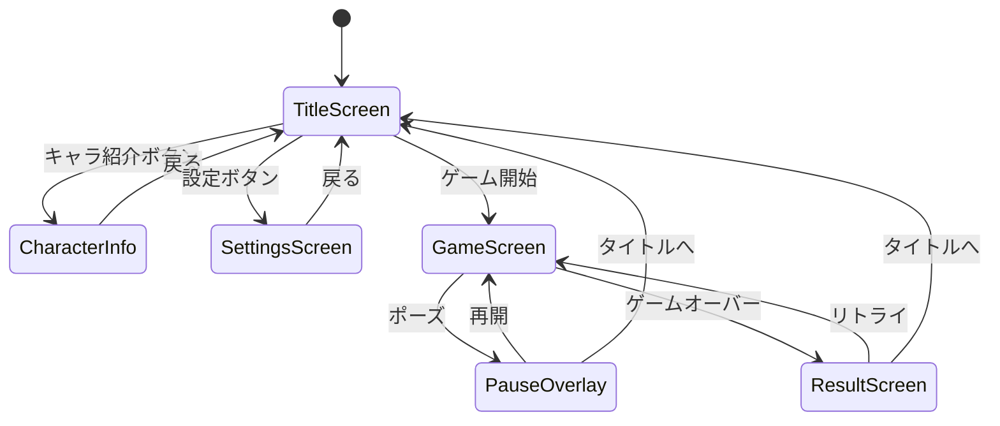
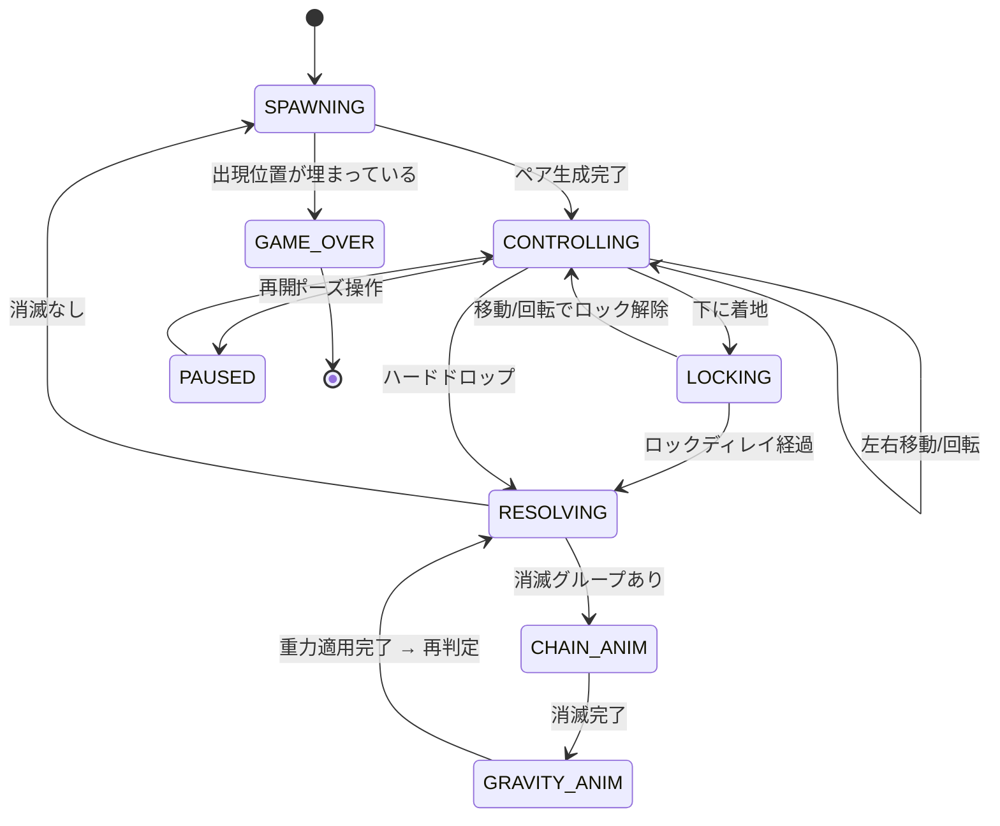

# SuwaPuyo（すわぷよ）— 詳細仕様書 v1.0

> **目的**: オリジナルキャラクターを使ったぷよぷよ風パズルゲーム  
> **到達品質**: 世界一のエンジニア/UIUX デザイナー/PDM 100人が触って感動するレベル  
> **第一目標**: Vercel でデプロイし、URL1つでスマホでもPCでもプレイできるデモを共有  
> **最終目標**: iOS / Android ネイティブアプリ化（要相談）

---

## 1. プロジェクト概要

| 項目 | 値 |
|---|---|
| プロジェクト名 | SuwaPuyo（すわぷよ） |
| リポジトリパス | `/home/ykoha/projects/suwapuyo` |
| 言語 | TypeScript（strict mode） |
| フレームワーク | React 18 + Vite 6 |
| ゲーム描画 | PixiJS 8（WebGL2 / WebGPU フォールバック） |
| 音声 | Howler.js 2.x |
| UI アニメーション | Framer Motion 11 |
| スタイリング | Vanilla CSS（CSS Modules） |
| デプロイ | Vercel（`git push` → 自動デプロイ） |
| 対応端末 | PC（キーボード操作）+ スマホ（タッチ操作） |
| ライセンス | 非公開（プライベートリポ） |

---

## 2. キャラクター（ぷよタイプ）定義

ゲーム内のぷよは従来の「色」ではなく、4体のオリジナルキャラクターで表現する。

### 2.1 キャラクター一覧

| ID | 仮名 | 見た目 | テーマカラー | 原画ファイル |
|---|---|---|---|---|
| `ghost` | おばけぷよ | 原子マーク付きゴースト | `#C8E6F0`（アイスブルー） | `media__1774074129315.png` |
| `tooth` | はっくん | 笑っている歯のキャラ | `#FFF5E0`（クリーム） | `media__1774074129581.png` |
| `blob` | ぺろりん | 舌を出したゴースト | `#E8E8F0`（ラベンダーグレー） | `media__1774074129813.png` |
| `tanuki` | タヌキ先輩 | ネクタイ着用のタヌキ | `#B08860`（タン） | `media__1774074129844.png` |

### 2.2 キャラクター別ゲーム設定

| パラメータ | `ghost` | `tooth` | `blob` | `tanuki` |
|---|---|---|---|---|
| 消滅に必要な連結数（`minPop`） | 4 | 4 | 3 | 5 |
| 消滅時 SE（1連鎖目） | `ghost_pop1` | `tooth_pop1` | `blob_pop1` | `tanuki_pop1` |
| 消滅時 SE（2連鎖目） | `ghost_pop2` | `tooth_pop2` | `blob_pop2` | `tanuki_pop2` |
| 消滅時 SE（3連鎖目） | `ghost_pop3` | `tooth_pop3` | `blob_pop3` | `tanuki_pop3` |
| 消滅時 SE（4連鎖以上） | `ghost_pop4` | `tooth_pop4` | `blob_pop4` | `tanuki_pop4` |
| 待機アニメーション | ゆらゆら浮遊 | ぷるぷる振動 | 舌ペロペロ | 腕組みで貧乏ゆすり |
| 消滅アニメーション | 原子が弾ける | キラーン＋粉砕 | 舌出して回転 | ネクタイ飛ばして退場 |

> [!IMPORTANT]
> `minPop` の値は仮設定。ゲームバランスを見ながら調整可能にする（設定画面から変更可能）。

### 2.3 キャラクタースプライト仕様

各キャラクターについて以下の状態別スプライトが必要：

| 状態 | サイズ | 説明 |
|---|---|---|
| `idle` | 64x64 px | 盤面に置かれている通常状態。盤面セル内に収まるサイズ |
| `falling` | 64x64 px | 落下中（やや縦に伸びる） |
| `connected` | 64x64 px | 同タイプと隣接している状態（笑顔/反応） |
| `popping` | 64x64 px | 消滅直前（驚き顔・膨張） |
| `preview` | 128x128 px | NEXT 表示やキャラ選択画面で使用 |

> [!NOTE]
> MVP（最小限の製品）では `idle` と `preview` のみ。他はアニメーションフェーズで追加。

---

## 3. ゲームメカニクス詳細

### 3.1 ボード仕様

```
  列: 0  1  2  3  4  5
       ┌──┬──┬──┬──┬──┬──┐
行 0   │  │  │  │  │  │  │  ← 非表示行（13行目: ぷよ出現位置）
       ├──┼──┼──┼──┼──┼──┤
行 1   │  │  │  │  │  │  │  ← 非表示行（14行目: この行まで詰まったらゲームオーバー判定）
       ├──┼──┼──┼──┼──┼──┤
行 2   │  │  │  │  │  │  │  ← ここから表示（画面上端）
       ├──┼──┼──┼──┼──┼──┤
  :    │  │  │  │  │  │  │
       ├──┼──┼──┼──┼──┼──┤
行 13  │  │  │  │  │  │  │  ← 画面下端
       └──┴──┴──┴──┴──┴──┘
```

| パラメータ | 値 | 備考 |
|---|---|---|
| 列数 | 6 | 標準ぷよぷよ準拠 |
| 行数 | 14（表示12 + 非表示2） | 行0,1は非表示領域 |
| セルサイズ | 64 x 64 px | スプライトと一致 |
| ボード描画サイズ | 384 x 768 px (6×12) | 非表示行は描画しない |
| ゲームオーバー判定列 | 列2（0-indexed） | 行1に残ったらゲームオーバー |

### 3.2 ぷよ組（ペア）

- 落下するぷよは常に **2個1組（ペア）**
- **軸ぷよ**（pivot）と**子ぷよ**（child）で構成
- 子ぷよは軸ぷよに対して4方向（上/右/下/左）のいずれかに接続
- 初期状態: 子ぷよは軸ぷよの**上**に配置

```
初期配置:
  [child]    ← 子ぷよ
  [pivot]    ← 軸ぷよ（操作基準点）

回転（時計回り）:
  [child]  →  [pivot][child]  →  [pivot]  →  [child][pivot]
  [pivot]                        [child]
```

### 3.3 操作

#### PC（キーボード）

| キー | アクション |
|---|---|
| ← / A | 左に移動 |
| → / D | 右に移動 |
| ↓ / S | ソフトドロップ（加速落下） |
| ↑ / W | ハードドロップ（即座に着地） |
| Z / Q | 左回転（反時計回り） |
| X / E | 右回転（時計回り） |
| Space | ポーズ / 再開 |
| R | リスタート |

#### スマホ（タッチ）

| ジェスチャー | アクション |
|---|---|
| 左スワイプ | 左に移動 |
| 右スワイプ | 右に移動 |
| 下スワイプ | ソフトドロップ |
| 下フリック（速い） | ハードドロップ |
| タップ（左半分） | 左回転 |
| タップ（右半分） | 右回転 |

### 3.4 落下・設置ロジック

```
落下速度テーブル:
  レベル1:  1セル / 1000ms（1秒）
  レベル2:  1セル / 900ms
  レベル3:  1セル / 800ms
  ...
  レベル10: 1セル / 100ms（最速）

ソフトドロップ: 通常の20倍速
ハードドロップ: 即座に最下部へ（アニメーションあり、50ms以内）

設置猶予（ロックディレイ）: 500ms
  → 着地後500ms以内なら左右移動・回転が可能
  → 500ms経過 or ハードドロップ → 設置確定
```

### 3.5 消滅判定アルゴリズム

```typescript
// 擬似コード
function findConnectedGroups(board: Board): Group[] {
  const visited = new Set<string>();
  const groups: Group[] = [];

  for (row = 0; row < ROWS; row++) {
    for (col = 0; col < COLS; col++) {
      if (visited.has(key(row, col))) continue;
      const cell = board[row][col];
      if (!cell) continue;

      // BFS: 同じタイプの隣接ぷよを探索
      const group = bfs(board, row, col, cell.type, visited);
      groups.push(group);
    }
  }
  return groups;
}

function clearGroups(groups: Group[]): ClearResult {
  const toClear: Group[] = [];

  for (const group of groups) {
    const type = group.type; // "ghost" | "tooth" | "blob" | "tanuki"
    const minPop = PUYO_CONFIG[type].minPop;

    if (group.cells.length >= minPop) {
      toClear.push(group);
    }
  }
  return { groups: toClear, chainStep: currentChain };
}
```

> [!IMPORTANT]
> **タイプごとに `minPop` が異なる**のがこのゲーム最大の特徴。  
> 例: `blob`（ぺろりん）は3個で消えるが、`tanuki`（タヌキ先輩）は5個必要。  
> これにより盤面の戦略性が大幅に変わる。

### 3.6 連鎖（チェイン）処理フロー

```
1. ぷよペア設置
   ↓
2. 重力適用（浮いているぷよを落とす）
   ↓
3. 連結グループ探索（BFS）
   ↓
4. 消滅条件を満たすグループがある？
   ├─ YES → 5へ
   └─ NO  → 8へ（連鎖終了）
   ↓
5. 消滅アニメーション再生（500ms）
   - タイプ別の消滅SE再生（連鎖数に応じたSE選択）
   - パーティクルエフェクト
   - スコア加算
   ↓
6. 消滅したぷよを盤面から除去
   ↓
7. 重力再適用 → 2に戻る（連鎖カウント+1）
   ↓
8. 次のぷよペアを生成 → 1に戻る
```

### 3.7 スコア計算

```
スコア = Σ（消滅グループごとの基本点 × 連鎖ボーナス × グループボーナス）

基本点 = 消滅ぷよ数 × 10
連鎖ボーナス = [0, 8, 16, 32, 64, 96, 128, 160, 192, 224, 256, ...]
グループボーナス = 消滅ぷよ数が minPop より多い分 × 2
  例: ghost(minPop=4) が 6個消えた → グループボーナス = (6-4) × 2 = 4
```

### 3.8 ゲームオーバー条件

- 列2（0-indexed）の行1にぷよが残った状態で次のペアが出現しようとしたらゲームオーバー
- ゲームオーバー演出: 全ぷよがグレーアウトして上から「沈む」アニメーション（1.5秒）

---

## 4. 画面構成

### 4.1 画面遷移図



### 4.2 各画面の詳細

#### 4.2.1 タイトル画面 (`TitleScreen`)

```
┌─────────────────────────────────────┐
│                                     │
│         🎮 SuwaPuyo                 │  ← ロゴ（アニメーション付き）
│           すわぷよ                   │
│                                     │
│    [ghost] [tooth] [blob] [tanuki]  │  ← 4キャラが並んで揺れている
│                                     │
│         ┌──────────────┐            │
│         │  ゲーム開始   │            │  ← メインボタン
│         └──────────────┘            │
│         ┌──────────────┐            │
│         │  キャラ紹介   │            │
│         └──────────────┘            │
│         ┌──────────────┐            │
│         │    設定       │            │
│         └──────────────┘            │
│                                     │
│  ♪ BGM ON/OFF          v1.0        │
│                                     │
└─────────────────────────────────────┘
```

- 背景: ダークグラデーション（`#0a0a1a` → `#1a1a3a`）+ 浮遊するぷよのパーティクル
- ロゴ: グロー効果 + 微妙にバウンスするアニメーション
- キャラクター: 各キャラが `idle` アニメーションしている
- ボタン: ガラスモーフィズム + ホバー時にグロー

#### 4.2.2 ゲーム画面 (`GameScreen`)

```
┌─────────────────────────────────────────────────────┐
│  SCORE          ┌──────────────┐          NEXT      │
│  12,450         │              │       ┌────────┐   │
│                 │              │       │[child] │   │
│  CHAIN          │              │       │[pivot] │   │
│  🔥 x3         │   ゲーム盤面  │       └────────┘   │
│                 │   (6 × 12)   │       ┌────────┐   │
│  LEVEL          │              │       │  NEXT2  │   │
│  Lv.3           │              │       └────────┘   │
│                 │              │                     │
│                 │              │   ┌─────────────┐   │
│                 │              │   │ キャラ情報   │   │
│                 │              │   │ ghost: 4個  │   │
│                 │              │   │ tooth: 4個  │   │
│                 │              │   │ blob:  3個  │   │
│                 │              │   │ tanuki:5個  │   │
│                 │              │   └─────────────┘   │
│                 └──────────────┘                     │
│                                          ⏸ PAUSE    │
└─────────────────────────────────────────────────────┘
```

- 盤面: 暗い背景に薄いグリッド線（ネオン風）
- NEXT: 次のぷよペアと、その次のペアを表示
- CHAIN: 連鎖発生中にアニメーション表示（炎エフェクト + 数字が弾ける）
- キャラ情報パネル: 各タイプの消滅数を常時表示（初心者向け）

#### 4.2.3 設定画面 (`SettingsScreen`)

| 設定項目 | UI | デフォルト |
|---|---|---|
| BGM音量 | スライダー（0〜100） | 70 |
| SE音量 | スライダー（0〜100） | 80 |
| ghost の消滅数 | 数値入力（2〜8） | 4 |
| tooth の消滅数 | 数値入力（2〜8） | 4 |
| blob の消滅数 | 数値入力（2〜8） | 3 |
| tanuki の消滅数 | 数値入力（2〜8） | 5 |
| 落下速度 | ドロップダウン（遅い/普通/速い） | 普通 |
| ゴーストピース表示 | トグル | ON |
| タッチ操作感度 | スライダー | 50 |

#### 4.2.4 リザルト画面 (`ResultScreen`)

```
┌─────────────────────────────────────┐
│                                     │
│          GAME OVER                  │
│                                     │
│       SCORE: 28,750                 │
│       MAX CHAIN: 5                  │
│       LEVEL: 7                      │
│       TIME: 03:42                   │
│                                     │
│    [ghost] [tooth] [blob] [tanuki]  │  ← キャラが泣き顔で並ぶ
│                                     │
│     ┌────────────┐  ┌────────────┐  │
│     │  リトライ   │  │  タイトル  │  │
│     └────────────┘  └────────────┘  │
│                                     │
└─────────────────────────────────────┘
```

---

## 5. アニメーション仕様

### 5.1 ぷよアニメーション

| アニメーション | トリガー | 時間 | イージング | 詳細 |
|---|---|---|---|---|
| **アイドル** | 常時 | 2000ms ループ | `ease-in-out` | Y軸 ±2px のゆっくり浮遊 + 微回転（±3°） |
| **落下** | 自動落下時 | `fallSpeed` に依存 | `linear` | Y軸方向に1セル移動 |
| **着地バウンス** | 設置確定時 | 300ms | `bounce` | Y軸 scaleY: 1→0.7→1.1→1.0、scaleX: 1→1.3→0.9→1.0 |
| **消滅フラッシュ** | 消滅判定時 | 200ms | `ease-out` | 白フラッシュ → 元色 を3回繰り返し |
| **消滅ポップ** | フラッシュ後 | 300ms | `ease-in` | scale: 1→1.5→0 + alpha: 1→0 + パーティクル放出 |
| **重力落下** | 消滅後 | 200ms | `ease-in` → バウンス | 空いた空間にぷよが落ちる + 着地バウンス |
| **回転** | 回転操作時 | 100ms | `ease-out` | 90° 回転（軸ぷよ中心に子ぷよが回る） |

### 5.2 エフェクト

| エフェクト | トリガー | 詳細 |
|---|---|---|
| **パーティクル爆発** | ぷよ消滅時 | 消滅位置から8〜12個の小さな丸が放射状に飛散。色はぷよのテーマカラー。寿命500ms |
| **連鎖数表示** | 連鎖発生時 | 「2れんさ！」「3れんさ！」を盤面中央に大きく表示。フォントサイズ拡大→縮小アニメーション |
| **画面シェイク** | 3連鎖以上 | 振幅: 連鎖数×2px、持続: 200ms |
| **グローライン** | 消滅グループ | 消滅するぷよ間に光のラインが走る。100ms |
| **背景パルス** | 連鎖時 | 背景色がテーマカラーに一瞬パルスする |

### 5.3 UI トランジション

| 遷移 | アニメーション | 時間 |
|---|---|---|
| 画面切替 | フェード + スライド（右方向） | 300ms |
| ポーズオーバーレイ | 背景ブラー + フェードイン | 200ms |
| ボタンホバー | スケール 1→1.05 + グロー | 150ms |
| スコア加算 | 数字がカウントアップ + 色変化 | 500ms |

---

## 6. 音声仕様

### 6.1 SE（効果音）一覧

| SE ID | タイミング | 説明 | 音量デフォルト |
|---|---|---|---|
| `move` | 左右移動 | 短いクリック音 | 0.3 |
| `rotate` | 回転 | カチッ音 | 0.4 |
| `softdrop` | ソフトドロップ中 | シュー音（ループ） | 0.2 |
| `harddrop` | ハードドロップ | ドスン音 | 0.6 |
| `land` | 設置確定 | ぽとん音 | 0.5 |
| `{type}_pop1` | 1連鎖目消滅 | タイプ別・低テンション | 0.7 |
| `{type}_pop2` | 2連鎖目消滅 | タイプ別・中テンション | 0.8 |
| `{type}_pop3` | 3連鎖目消滅 | タイプ別・高テンション | 0.9 |
| `{type}_pop4` | 4連鎖以上消滅 | タイプ別・最高テンション | 1.0 |
| `chain_voice` | 連鎖発生 | 「にれんさ！」「さんれんさ！」の音声 | 0.8 |
| `gameover` | ゲームオーバー | 残念音 | 0.6 |
| `levelup` | レベルアップ | ファンファーレ | 0.7 |

### 6.2 BGM

| BGM ID | 画面 | ループ | BPM目安 |
|---|---|---|---|
| `title_bgm` | タイトル画面 | はい | 120 |
| `game_bgm` | ゲーム中 | はい | 140 |
| `result_bgm` | リザルト | はい | 100 |

> [!NOTE]
> MVP段階では仮のフリー素材SE/BGMを使用する。最終版で差し替え可能な構造にしておく。

### 6.3 音声再生ルール

```typescript
// 連鎖時のSE選択ロジック
function getPopSound(type: PuyoType, chainCount: number): string {
  const popLevel = Math.min(chainCount, 4); // 4以上は全て pop4
  return `${type}_pop${popLevel}`;
}

// 同時に複数タイプが消える場合
function playPopSounds(clearedGroups: Group[], chainCount: number): void {
  // 各タイプのSEを同時再生（最大4音同時）
  const playedTypes = new Set<PuyoType>();
  for (const group of clearedGroups) {
    if (!playedTypes.has(group.type)) {
      playedTypes.add(group.type);
      const soundId = getPopSound(group.type, chainCount);
      howler.play(soundId);
    }
  }
}
```

---

## 7. 技術アーキテクチャ

### 7.1 ディレクトリ構造

```
suwapuyo/
├── public/
│   ├── assets/
│   │   ├── sprites/          # キャラクタースプライト（PNG）
│   │   │   ├── ghost/
│   │   │   │   ├── idle.png
│   │   │   │   ├── connected.png
│   │   │   │   └── popping.png
│   │   │   ├── tooth/
│   │   │   ├── blob/
│   │   │   └── tanuki/
│   │   ├── effects/          # エフェクトスプライト
│   │   └── ui/               # UIアイコン等
│   ├── audio/
│   │   ├── se/               # 効果音
│   │   │   ├── ghost_pop1.mp3
│   │   │   ├── ghost_pop2.mp3
│   │   │   ├── ...
│   │   │   ├── move.mp3
│   │   │   └── land.mp3
│   │   └── bgm/              # BGM
│   │       ├── title.mp3
│   │       └── game.mp3
│   └── fonts/                # Webフォント
├── src/
│   ├── main.tsx              # エントリーポイント
│   ├── App.tsx               # ルートコンポーネント + ルーティング
│   ├── config/
│   │   ├── constants.ts      # ゲーム定数（ROWS, COLS, セルサイズ等）
│   │   ├── puyoTypes.ts      # キャラクター設定（minPop, SE定義等）
│   │   └── controls.ts       # キーバインド設定
│   ├── types/
│   │   ├── game.ts           # ゲーム状態の型定義
│   │   ├── puyo.ts           # ぷよ関連の型
│   │   └── audio.ts          # 音声関連の型
│   ├── engine/               # ゲームロジック（React非依存・純粋TypeScript）
│   │   ├── Board.ts          # 盤面管理（2D配列、セル操作）
│   │   ├── PuyoPair.ts       # ぷよペア（移動・回転ロジック）
│   │   ├── Gravity.ts        # 重力処理
│   │   ├── Matcher.ts        # BFS連結探索 + 消滅判定
│   │   ├── ChainResolver.ts  # 連鎖処理（消滅→重力→再判定ループ）
│   │   ├── Scorer.ts         # スコア計算
│   │   ├── PuyoGenerator.ts  # ぷよ生成（ランダム、NEXTキュー管理）
│   │   └── GameLoop.ts       # ゲームループ（状態機械）
│   ├── renderer/             # PixiJS 描画レイヤー
│   │   ├── GameRenderer.ts   # メインレンダラー（PixiJS Application管理）
│   │   ├── BoardRenderer.ts  # 盤面描画
│   │   ├── PuyoSprite.ts     # 個別ぷよスプライト管理
│   │   ├── EffectRenderer.ts # エフェクト描画（パーティクル、フラッシュ等）
│   │   ├── NextRenderer.ts   # NEXT表示描画
│   │   └── AnimationManager.ts # アニメーション統括
│   ├── audio/
│   │   ├── AudioManager.ts   # Howler.js ラッパー（SE/BGM一括管理）
│   │   └── audioAssets.ts    # 音声アセットID定義
│   ├── input/
│   │   ├── KeyboardInput.ts  # キーボード入力管理
│   │   └── TouchInput.ts     # タッチ入力管理
│   ├── components/           # React UIコンポーネント
│   │   ├── screens/
│   │   │   ├── TitleScreen.tsx
│   │   │   ├── GameScreen.tsx      # PixiJS Canvas を含むメイン画面
│   │   │   ├── SettingsScreen.tsx
│   │   │   ├── CharacterInfoScreen.tsx
│   │   │   └── ResultScreen.tsx
│   │   ├── ui/
│   │   │   ├── ScoreDisplay.tsx
│   │   │   ├── ChainDisplay.tsx
│   │   │   ├── NextDisplay.tsx
│   │   │   ├── PauseOverlay.tsx
│   │   │   ├── Button.tsx
│   │   │   ├── Slider.tsx
│   │   │   └── Toggle.tsx
│   │   └── layout/
│   │       ├── GameLayout.tsx      # ゲーム画面のレイアウト
│   │       └── CenterLayout.tsx    # 中央寄せレイアウト
│   ├── hooks/
│   │   ├── useGame.ts        # ゲーム状態管理（メインhook）
│   │   ├── useAudio.ts       # 音声管理hook
│   │   ├── useInput.ts       # 入力管理hook
│   │   └── useSettings.ts    # 設定管理hook（localStorage永続化）
│   └── styles/
│       ├── index.css         # グローバルスタイル + CSS変数
│       ├── title.module.css
│       ├── game.module.css
│       ├── settings.module.css
│       └── result.module.css
├── index.html
├── vite.config.ts
├── tsconfig.json
├── package.json
├── vercel.json               # Vercel設定（SPA リライト）
├── .gitignore
└── README.md
```

### 7.2 レイヤー分離原則

```
┌────────────────────────────────────────────────┐
│                React UI Layer                   │
│  (components/, hooks/)                         │
│  - 画面遷移、スコア表示、設定画面              │
│  - Framer Motion によるUI アニメーション        │
├────────────────────────────────────────────────┤
│              PixiJS Renderer Layer              │
│  (renderer/)                                   │
│  - 盤面描画、ぷよスプライト管理                │
│  - パーティクルエフェクト                      │
│  - 60fps ゲームアニメーション                   │
├────────────────────────────────────────────────┤
│              Game Engine Layer                  │
│  (engine/)                                     │
│  - 純粋TypeScript（UIフレームワーク非依存）    │
│  - Board, Matcher, Gravity, Scorer             │
│  - 単体テスト可能                              │
├────────────────────────────────────────────────┤
│              Audio Layer                        │
│  (audio/)                                      │
│  - Howler.js による音声再生管理                │
│  - SE/BGM のプリロード・音量制御               │
├────────────────────────────────────────────────┤
│              Input Layer                        │
│  (input/)                                      │
│  - キーボード / タッチ入力の抽象化             │
│  - 操作 → アクション のマッピング              │
└────────────────────────────────────────────────┘
```

> [!IMPORTANT]
> **engine/ は React, PixiJS, Howler.js に一切依存しない。**  
> これにより:
> - 単体テストが容易
> - 将来 React Native やネイティブアプリに移植する際、ロジックをそのまま使える
> - 描画エンジンを差し替えても（例: Canvas2D → WebGL → ネイティブ）ロジックに影響なし

### 7.3 ゲームステートマシン

```typescript
type GameState =
  | "SPAWNING"      // 新しいぷよペアを生成中
  | "CONTROLLING"   // プレイヤー操作中（落下）
  | "LOCKING"       // 着地猶予（ロックディレイ）
  | "RESOLVING"     // 連鎖解決中（消滅→重力のループ）
  | "CHAIN_ANIM"    // 消滅アニメーション再生中
  | "GRAVITY_ANIM"  // 重力落下アニメーション再生中  
  | "GAME_OVER"     // ゲームオーバー
  | "PAUSED";       // ポーズ中
```



---

## 8. レスポンシブ対応

### 8.1 ブレークポイント

| デバイス | 幅 | レイアウト |
|---|---|---|
| スマホ縦 | 〜480px | 盤面フル幅、UI は上下に配置 |
| スマホ横 / タブレット | 481〜768px | 盤面中央、サイドにNEXT/スコア |
| PC | 769px〜 | 盤面中央、左にスコア系、右にNEXT系 |

### 8.2 スケーリング

```typescript
// セルサイズ = min(viewportWidth / 8, viewportHeight / 16, 64)
// 8 = 6列 + 左右マージン各1列分
// 16 = 12行 + 上下マージン各2行分
const cellSize = Math.min(
  window.innerWidth / 8,
  window.innerHeight / 16,
  64
);
```

---

## 9. データ永続化

| データ | 保存先 | 形式 |
|---|---|---|
| 設定（音量、消滅数等） | `localStorage` | JSON |
| ハイスコア | `localStorage` | JSON |
| 将来: オンラインランキング | 別途API（スコープ外） | — |

---

## 10. MVP と将来拡張

### 10.1 MVP（v1.0 = 今回の成果物）

- [x] 4キャラのぷよがCanvasで描画される
- [x] キーボード + タッチで操作可能
- [x] タイプ別消滅数が動作する
- [x] 連鎖が正しく処理される
- [x] 連鎖ごとにSEが変わる
- [x] 消滅アニメーション（フラッシュ + ポップ + パーティクル）
- [x] 着地バウンスアニメーション
- [x] スコア/連鎖数/レベル表示
- [x] タイトル画面 / ゲーム画面 / リザルト画面
- [x] 設定画面（音量、消滅数調整）
- [x] レスポンシブ（PC + スマホ）
- [x] Vercelデプロイ

### 10.2 将来拡張（スコープ外）

- [ ] CPU対戦 AI
- [ ] オンライン対戦（WebSocket）
- [ ] おじゃまぷよ
- [ ] 特殊ぷよ（全消し等）
- [ ] リプレイ機能
- [ ] オンラインランキング
- [ ] iOS / Android アプリ化（Capacitor or React Native）
- [ ] AR モード

---

## 付録: キャラクター原画パス

| キャラ | 原画絶対パス |
|---|---|
| ghost | `/home/ykoha/.gemini/antigravity/brain/c7b01e74-6332-47eb-8be2-1f6d74674a80/media__1774074129315.png` |
| tooth | `/home/ykoha/.gemini/antigravity/brain/c7b01e74-6332-47eb-8be2-1f6d74674a80/media__1774074129581.png` |
| blob | `/home/ykoha/.gemini/antigravity/brain/c7b01e74-6332-47eb-8be2-1f6d74674a80/media__1774074129813.png` |
| tanuki | `/home/ykoha/.gemini/antigravity/brain/c7b01e74-6332-47eb-8be2-1f6d74674a80/media__1774074129844.png` |
