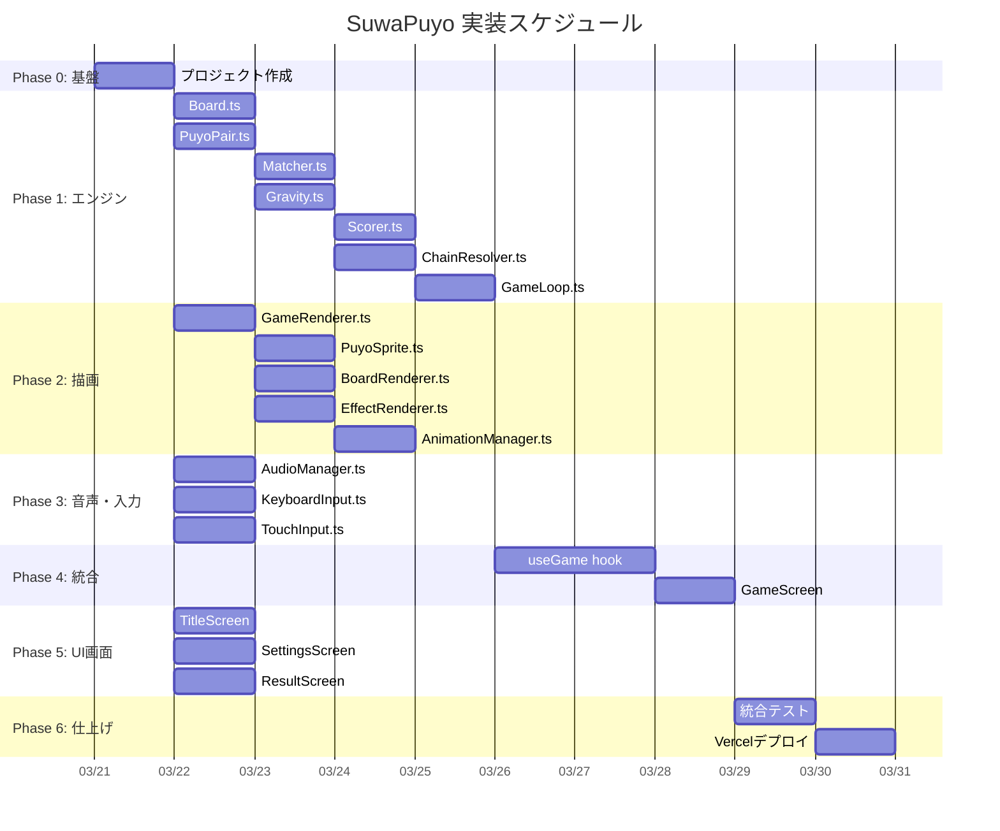

# SuwaPuyo 実装TODO — 超詳細版

> **並列処理方針**: 各タスクには `依存タスク` を明記。依存がないタスク同士は **同時並列実行可能**。  
> GPT5.4 の自動並列処理でこのTODOを渡せば、依存関係を見て最大効率でタスクを並列実行できる。

---

## フェーズ概要



---

## Phase 0: プロジェクト基盤セットアップ

### TASK-000: Vite + React + TypeScript プロジェクト作成
- **ファイル**: プロジェクトルート全体
- **依存タスク**: なし
- **コマンド**:
  ```bash
  cd /home/ykoha/projects/suwapuyo
  npx -y create-vite@latest ./ --template react-ts
  ```
- **完了条件**: `npm run dev` で localhost にReactのデフォルトページが表示される

### TASK-001: 追加依存パッケージのインストール
- **依存タスク**: TASK-000
- **コマンド**:
  ```bash
  npm install pixi.js@^8 howler framer-motion
  npm install -D @types/howler
  ```
- **完了条件**: `package.json` に4パッケージが追加されている

### TASK-002: ディレクトリ構造作成
- **依存タスク**: TASK-000
- **コマンド**:
  ```bash
  mkdir -p src/{config,types,engine,renderer,audio,input,components/{screens,ui,layout},hooks,styles}
  mkdir -p public/{assets/{sprites/{ghost,tooth,blob,tanuki},effects,ui},audio/{se,bgm},fonts}
  ```
- **完了条件**: 上記ディレクトリが全て存在する

### TASK-003: 基本設定ファイル作成
- **依存タスク**: TASK-002
- **ファイル**: 
  - `src/config/constants.ts`
  - `src/config/puyoTypes.ts`
  - `src/config/controls.ts`
- **内容**:
  ```typescript
  // constants.ts
  export const BOARD_COLS = 6;
  export const BOARD_ROWS = 14; // 表示12 + 非表示2
  export const VISIBLE_ROWS = 12;
  export const HIDDEN_ROWS = 2;
  export const CELL_SIZE = 64;
  export const BOARD_WIDTH = BOARD_COLS * CELL_SIZE;   // 384
  export const BOARD_HEIGHT = VISIBLE_ROWS * CELL_SIZE; // 768
  export const SPAWN_COL = 2;
  export const SPAWN_ROW = 0;
  export const LOCK_DELAY_MS = 500;
  export const SOFT_DROP_MULTIPLIER = 20;
  export const FALL_SPEEDS = [1000, 900, 800, 700, 600, 500, 400, 300, 200, 100];
  export const POP_ANIM_MS = 500;
  export const GRAVITY_ANIM_MS = 200;
  export const BOUNCE_ANIM_MS = 300;
  ```
  ```typescript
  // puyoTypes.ts
  export type PuyoType = "ghost" | "tooth" | "blob" | "tanuki";
  
  export interface PuyoTypeConfig {
    id: PuyoType;
    name: string;
    themeColor: string;
    defaultMinPop: number;
    sounds: {
      pop1: string;
      pop2: string;
      pop3: string;
      pop4: string;
    };
    sprites: {
      idle: string;
      connected: string;
      popping: string;
      preview: string;
    };
  }
  
  export const PUYO_TYPES: Record<PuyoType, PuyoTypeConfig> = {
    ghost: {
      id: "ghost",
      name: "おばけぷよ",
      themeColor: "#C8E6F0",
      defaultMinPop: 4,
      sounds: { pop1: "ghost_pop1", pop2: "ghost_pop2", pop3: "ghost_pop3", pop4: "ghost_pop4" },
      sprites: { idle: "/assets/sprites/ghost/idle.png", connected: "/assets/sprites/ghost/connected.png", popping: "/assets/sprites/ghost/popping.png", preview: "/assets/sprites/ghost/preview.png" },
    },
    tooth: {
      id: "tooth",
      name: "はっくん",
      themeColor: "#FFF5E0",
      defaultMinPop: 4,
      sounds: { pop1: "tooth_pop1", pop2: "tooth_pop2", pop3: "tooth_pop3", pop4: "tooth_pop4" },
      sprites: { idle: "/assets/sprites/tooth/idle.png", connected: "/assets/sprites/tooth/connected.png", popping: "/assets/sprites/tooth/popping.png", preview: "/assets/sprites/tooth/preview.png" },
    },
    blob: {
      id: "blob",
      name: "ぺろりん",
      themeColor: "#E8E8F0",
      defaultMinPop: 3,
      sounds: { pop1: "blob_pop1", pop2: "blob_pop2", pop3: "blob_pop3", pop4: "blob_pop4" },
      sprites: { idle: "/assets/sprites/blob/idle.png", connected: "/assets/sprites/blob/connected.png", popping: "/assets/sprites/blob/popping.png", preview: "/assets/sprites/blob/preview.png" },
    },
    tanuki: {
      id: "tanuki",
      name: "タヌキ先輩",
      themeColor: "#B08860",
      defaultMinPop: 5,
      sounds: { pop1: "tanuki_pop1", pop2: "tanuki_pop2", pop3: "tanuki_pop3", pop4: "tanuki_pop4" },
      sprites: { idle: "/assets/sprites/tanuki/idle.png", connected: "/assets/sprites/tanuki/connected.png", popping: "/assets/sprites/tanuki/popping.png", preview: "/assets/sprites/tanuki/preview.png" },
    },
  };
  
  export const PUYO_TYPE_IDS: PuyoType[] = ["ghost", "tooth", "blob", "tanuki"];
  ```
- **完了条件**: 各ファイルがTypeScriptコンパイルエラーなし

### TASK-004: 型定義ファイル作成
- **依存タスク**: TASK-003
- **ファイル**:
  - `src/types/game.ts`
  - `src/types/puyo.ts`
  - `src/types/audio.ts`
- **内容**:
  ```typescript
  // puyo.ts
  import { PuyoType } from "../config/puyoTypes";
  
  export interface PuyoCell {
    type: PuyoType;
    row: number;
    col: number;
  }
  
  export type BoardGrid = (PuyoCell | null)[][];
  
  export enum Direction {
    UP = 0,
    RIGHT = 1,
    DOWN = 2,
    LEFT = 3,
  }
  
  export interface PuyoPairState {
    pivot: PuyoCell;
    child: PuyoCell;
    childDirection: Direction;
  }
  
  export interface ConnectedGroup {
    type: PuyoType;
    cells: { row: number; col: number }[];
  }
  
  export interface ClearResult {
    groups: ConnectedGroup[];
    chainStep: number;
    score: number;
  }
  ```
  ```typescript
  // game.ts
  import { BoardGrid, PuyoPairState } from "./puyo";
  import { PuyoType } from "../config/puyoTypes";
  
  export type GamePhase =
    | "SPAWNING"
    | "CONTROLLING"
    | "LOCKING"
    | "RESOLVING"
    | "CHAIN_ANIM"
    | "GRAVITY_ANIM"
    | "GAME_OVER"
    | "PAUSED";
  
  export interface GameState {
    phase: GamePhase;
    board: BoardGrid;
    currentPair: PuyoPairState | null;
    nextPairs: PuyoPairState[];
    score: number;
    chainCount: number;
    maxChain: number;
    level: number;
    linesCleared: number;
    elapsedMs: number;
    minPopSettings: Record<PuyoType, number>;
  }
  
  export type GameAction =
    | { type: "MOVE_LEFT" }
    | { type: "MOVE_RIGHT" }
    | { type: "ROTATE_CW" }
    | { type: "ROTATE_CCW" }
    | { type: "SOFT_DROP" }
    | { type: "HARD_DROP" }
    | { type: "TICK"; dt: number }
    | { type: "PAUSE" }
    | { type: "RESUME" }
    | { type: "RESTART" };
  ```
- **完了条件**: 全型定義ファイルがコンパイルエラーなし

### TASK-005: キャラクタースプライト（idle）を作成して配置
- **依存タスク**: TASK-002
- **作業内容**:
  - 原画4枚をそれぞれ 64x64 px にリサイズして `idle.png` として保存
  - 128x128 px 版を `preview.png` として保存
  - 配置先:
    - `public/assets/sprites/ghost/idle.png` & `preview.png`
    - `public/assets/sprites/tooth/idle.png` & `preview.png`
    - `public/assets/sprites/blob/idle.png` & `preview.png`
    - `public/assets/sprites/tanuki/idle.png` & `preview.png`
- **原画パス**:
  - ghost: `/home/ykoha/.gemini/antigravity/brain/c7b01e74-6332-47eb-8be2-1f6d74674a80/media__1774074129315.png`
  - tooth: `/home/ykoha/.gemini/antigravity/brain/c7b01e74-6332-47eb-8be2-1f6d74674a80/media__1774074129581.png`
  - blob: `/home/ykoha/.gemini/antigravity/brain/c7b01e74-6332-47eb-8be2-1f6d74674a80/media__1774074129813.png`
  - tanuki: `/home/ykoha/.gemini/antigravity/brain/c7b01e74-6332-47eb-8be2-1f6d74674a80/media__1774074129844.png`
- **完了条件**: 8ファイル（4キャラ×2サイズ）が正しいサイズで配置されている

### TASK-006: 仮SE/BGMを用意して配置
- **依存タスク**: TASK-002
- **作業内容**:
  - フリー素材 or Web Audio APIで生成した仮のSEを配置
  - 最低限必要なファイル:
    ```
    public/audio/se/move.mp3
    public/audio/se/rotate.mp3
    public/audio/se/land.mp3
    public/audio/se/harddrop.mp3
    public/audio/se/ghost_pop1.mp3 ... ghost_pop4.mp3
    public/audio/se/tooth_pop1.mp3 ... tooth_pop4.mp3
    public/audio/se/blob_pop1.mp3  ... blob_pop4.mp3
    public/audio/se/tanuki_pop1.mp3 ... tanuki_pop4.mp3
    public/audio/se/gameover.mp3
    public/audio/bgm/game.mp3
    ```
  - 仮音声はWeb Audio APIでプログラム生成可能（ビープ音のバリエーション）
- **完了条件**: 上記ファイルが全て存在し、Howler.jsで再生可能

### TASK-007: グローバルCSS + CSS変数定義
- **依存タスク**: TASK-000
- **ファイル**: `src/styles/index.css`
- **内容**:
  ```css
  @import url('https://fonts.googleapis.com/css2?family=Inter:wght@400;600;700;900&family=Noto+Sans+JP:wght@400;700;900&display=swap');
  
  :root {
    /* Colors */
    --color-bg-primary: #0a0a1a;
    --color-bg-secondary: #1a1a3a;
    --color-bg-card: rgba(255, 255, 255, 0.05);
    --color-text-primary: #ffffff;
    --color-text-secondary: rgba(255, 255, 255, 0.7);
    --color-accent: #6366f1;
    --color-accent-glow: rgba(99, 102, 241, 0.4);
    --color-ghost: #C8E6F0;
    --color-tooth: #FFF5E0;
    --color-blob: #E8E8F0;
    --color-tanuki: #B08860;
    
    /* Typography */
    --font-primary: 'Inter', 'Noto Sans JP', sans-serif;
    --font-game: 'Inter', monospace;
    
    /* Spacing */
    --space-xs: 4px;
    --space-sm: 8px;
    --space-md: 16px;
    --space-lg: 24px;
    --space-xl: 32px;
    --space-2xl: 48px;
    
    /* Border Radius */
    --radius-sm: 8px;
    --radius-md: 12px;
    --radius-lg: 16px;
    --radius-full: 9999px;
    
    /* Shadows */
    --shadow-glow: 0 0 20px var(--color-accent-glow);
    --shadow-card: 0 4px 24px rgba(0, 0, 0, 0.6);
    
    /* Transitions */
    --transition-fast: 150ms ease;
    --transition-normal: 300ms ease;
  }
  
  * { margin: 0; padding: 0; box-sizing: border-box; }
  
  body {
    font-family: var(--font-primary);
    background: linear-gradient(135deg, var(--color-bg-primary), var(--color-bg-secondary));
    color: var(--color-text-primary);
    min-height: 100vh;
    overflow: hidden;
    -webkit-font-smoothing: antialiased;
    user-select: none;
    -webkit-user-select: none;
    touch-action: manipulation;
  }
  
  #root {
    width: 100vw;
    height: 100vh;
    display: flex;
    align-items: center;
    justify-content: center;
  }
  ```
- **完了条件**: ダークグラデーション背景が表示される

### TASK-008: Vercel設定ファイル作成
- **依存タスク**: TASK-000
- **ファイル**: `vercel.json`
- **内容**:
  ```json
  {
    "rewrites": [{ "source": "/(.*)", "destination": "/" }]
  }
  ```
- **完了条件**: ファイルが存在する

---

## Phase 1: ゲームエンジン（engine/）

> **並列可能**: TASK-100, TASK-101 は同時実行可能（互いに依存しない）

### TASK-100: Board.ts — 盤面管理
- **依存タスク**: TASK-003, TASK-004
- **ファイル**: `src/engine/Board.ts`
- **責務**: 2D配列の初期化・セルの読み書き・盤面コピー
- **公開API**:
  ```typescript
  export class Board {
    private grid: BoardGrid;
    constructor();
    getCell(row: number, col: number): PuyoCell | null;
    setCell(row: number, col: number, cell: PuyoCell | null): void;
    isInBounds(row: number, col: number): boolean;
    isEmpty(row: number, col: number): boolean;
    clone(): Board;
    getGrid(): BoardGrid; // 読み取り専用コピー
    clear(): void;
  }
  ```
- **完了条件**: 以下のユニットテストが通る
  - 空の盤面を作成できる
  - セルの設置・取得ができる
  - 範囲外アクセスで `null` が返る
  - `clone()` が独立したコピーを返す

### TASK-101: PuyoPair.ts — ぷよペア操作
- **依存タスク**: TASK-003, TASK-004
- **ファイル**: `src/engine/PuyoPair.ts`
- **責務**: ぷよペアの移動・回転ロジック（壁蹴り含む）
- **公開API**:
  ```typescript
  export class PuyoPair {
    pivot: { row: number; col: number; type: PuyoType };
    child: { row: number; col: number; type: PuyoType };
    childDirection: Direction;
    
    moveLeft(board: Board): boolean;   // 成功したら true
    moveRight(board: Board): boolean;
    moveDown(board: Board): boolean;
    rotateCW(board: Board): boolean;   // 時計回り（壁蹴り込み）
    rotateCCW(board: Board): boolean;  // 反時計回り
    canMoveDown(board: Board): boolean;
    getGhostPosition(board: Board): { pivotRow: number; childRow: number };
    place(board: Board): void;         // 盤面に設置（pivotとchildをboardに書き込む）
  }
  ```
- **壁蹴りルール**:
  ```
  回転先が壁 or 他のぷよで塞がっている場合:
  1. 反対方向に1マスずらして再試行
  2. それでもダメなら回転を拒否（return false）
  
  床で回転する場合:
  1. 上に1マス持ち上げて再試行
  2. それでもダメなら回転を拒否
  ```
- **完了条件**: 以下のユニットテストが通る
  - 空盤面で左右移動が正しく動く
  - 壁際で壁蹴りが正しく動く
  - 4方向すべての回転が正しい
  - 他のぷよが邪魔で移動・回転できない場合に false が返る

### TASK-102: Matcher.ts — BFS連結探索 + 消滅判定
- **依存タスク**: TASK-100
- **ファイル**: `src/engine/Matcher.ts`
- **責務**: 同タイプの連結グループを BFS で探索し、消滅条件を判定
- **公開API**:
  ```typescript
  export class Matcher {
    findConnectedGroups(board: Board): ConnectedGroup[];
    findClearableGroups(
      board: Board,
      minPopSettings: Record<PuyoType, number>
    ): ConnectedGroup[];
  }
  ```
- **アルゴリズム**:
  ```
  1. visited集合を初期化
  2. 全セルを走査
  3. 未訪問かつ非空のセルを見つけたら BFS 開始
  4. 上下左右の隣接セルが同じタイプなら queue に追加
  5. BFS 完了でグループを確定
  6. グループのサイズ >= minPopSettings[type] なら clearable に追加
  ```
- **完了条件**:
  - 4個連結の ghost グループが正しく検出される
  - 3個連結の blob グループが正しく clearable になる
  - 5個未満の tanuki グループが clearable にならない
  - L字型、T字型の連結が正しく検出される
  - 異なるタイプ同士が混ざらない

### TASK-103: Gravity.ts — 重力処理
- **依存タスク**: TASK-100
- **ファイル**: `src/engine/Gravity.ts`
- **責務**: 浮いているぷよを下に落とす
- **公開API**:
  ```typescript
  export class Gravity {
    // 重力を適用し、移動したぷよの情報を返す
    apply(board: Board): GravityResult;
  }
  
  export interface GravityMove {
    type: PuyoType;
    fromRow: number;
    fromCol: number;
    toRow: number;
    toCol: number;
  }
  
  export interface GravityResult {
    moves: GravityMove[];
    hasChanges: boolean;
  }
  ```
- **アルゴリズム**:
  ```
  各列について:
  1. 下から上に走査
  2. 空セルを見つけたら、その上にあるぷよを落とす
  3. 移動距離を記録（アニメーション用）
  ```
- **完了条件**:
  - 1つの空きの下にぷよが落ちる
  - 複数の空きを飛び越えて落ちる
  - 空きがない列は変化なし

### TASK-104: Scorer.ts — スコア計算
- **依存タスク**: TASK-003
- **ファイル**: `src/engine/Scorer.ts`
- **公開API**:
  ```typescript
  export class Scorer {
    calculateScore(clearResult: {
      groups: ConnectedGroup[];
      chainStep: number;
      minPopSettings: Record<PuyoType, number>;
    }): number;
    
    getChainBonus(chainStep: number): number;
    getGroupBonus(groupSize: number, minPop: number): number;
  }
  ```
- **完了条件**: スコア計算が仕様書 §3.7 の計算式と一致する

### TASK-105: PuyoGenerator.ts — ぷよ生成
- **依存タスク**: TASK-003
- **ファイル**: `src/engine/PuyoGenerator.ts`
- **責務**: ランダムなぷよペアを生成、NEXT キューを管理
- **公開API**:
  ```typescript
  export class PuyoGenerator {
    private queue: PuyoPairState[];
    
    constructor(seed?: number); // シード指定可能（リプレイ用）
    next(): PuyoPairState;      // キューから1つ取り出し、新しいのを補充
    peek(count: number): PuyoPairState[]; // 先読み
  }
  ```
- **ルール**:
  - 4タイプから均等にランダム選出
  - ただし同じタイプが3回連続しないように制御
- **完了条件**: 100回生成して4タイプがほぼ均等に出現する

### TASK-106: ChainResolver.ts — 連鎖処理
- **依存タスク**: TASK-102, TASK-103, TASK-104
- **ファイル**: `src/engine/ChainResolver.ts`
- **責務**: 消滅→重力→再判定のループをステップ実行
- **公開API**:
  ```typescript
  export interface ChainStep {
    stepNumber: number;       // 1, 2, 3, ...
    clearedGroups: ConnectedGroup[];
    gravityMoves: GravityMove[];
    scoreGained: number;
  }
  
  export class ChainResolver {
    // 1ステップずつ連鎖を解決（アニメーション制御のため）
    resolveStep(board: Board, minPopSettings: Record<PuyoType, number>): ChainStep | null;
    // null = もう消えるものがない（連鎖終了）
  }
  ```
- **完了条件**:
  - 単発消滅で chainStep=1 が返る
  - 2連鎖で chainStep=1, 2 が順に返る
  - 消すものがないとき null が返る

### TASK-107: GameLoop.ts — ゲームループ（ステートマシン）
- **依存タスク**: TASK-100, TASK-101, TASK-105, TASK-106
- **ファイル**: `src/engine/GameLoop.ts`
- **責務**: ゲーム全体の状態管理（ステートマシン）
- **公開API**:
  ```typescript
  export class GameLoop {
    private state: GameState;
    
    constructor(settings: GameSettings);
    
    getState(): Readonly<GameState>;
    dispatch(action: GameAction): GameEvent[];
    // GameEvent: UI/音声/描画レイヤーへの通知
    // 例: { type: "PUYO_LANDED" }, { type: "CHAIN_STARTED", chainStep: 2 }, etc.
    
    tick(deltaMs: number): GameEvent[];
    // 毎フレーム呼ばれる。落下処理 + 状態遷移
  }
  
  export type GameEvent =
    | { type: "PIECE_SPAWNED"; pair: PuyoPairState }
    | { type: "PIECE_MOVED"; direction: "left" | "right" | "down" }
    | { type: "PIECE_ROTATED"; direction: "cw" | "ccw" }
    | { type: "PIECE_LANDED" }
    | { type: "PIECE_LOCKED" }
    | { type: "HARD_DROPPED" }
    | { type: "CHAIN_STEP"; step: ChainStep }
    | { type: "CHAIN_ENDED"; totalChain: number; totalScore: number }
    | { type: "GRAVITY_APPLIED"; moves: GravityMove[] }
    | { type: "LEVEL_UP"; newLevel: number }
    | { type: "GAME_OVER"; finalScore: number }
    | { type: "PAUSED" }
    | { type: "RESUMED" };
  ```
- **完了条件**:
  - SPAWNING → CONTROLLING → LOCKING → RESOLVING → SPAWNING のフルサイクルが動く
  - ゲームオーバーが正しく検出される
  - ポーズ/再開が動く

---

## Phase 2: 描画レイヤー（renderer/）

> **並列可能**: TASK-200 完了後、TASK-201, TASK-202, TASK-203 は同時実行可能

### TASK-200: GameRenderer.ts — PixiJS 初期化
- **依存タスク**: TASK-001
- **ファイル**: `src/renderer/GameRenderer.ts`
- **責務**: PixiJS Application の初期化、Canvas を React DOM に接続
- **公開API**:
  ```typescript
  export class GameRenderer {
    private app: Application;
    
    async init(container: HTMLElement, width: number, height: number): Promise<void>;
    resize(width: number, height: number): void;
    getStage(): Container;
    destroy(): void;
  }
  ```
- **完了条件**: React コンポーネントから Canvas が表示される（黒い画面でOK）

### TASK-201: PuyoSprite.ts — ぷよスプライト管理
- **依存タスク**: TASK-200, TASK-005
- **ファイル**: `src/renderer/PuyoSprite.ts`
- **責務**: 1個のぷよの描画管理（スプライト差し替え、アニメーション）
- **公開API**:
  ```typescript
  export class PuyoSprite {
    private sprite: Sprite;
    private type: PuyoType;
    
    constructor(type: PuyoType, stage: Container);
    setPosition(row: number, col: number, cellSize: number): void;
    setType(type: PuyoType): void;
    
    // アニメーション
    playIdle(): void;           // ゆらゆら
    playBounce(): Promise<void>; // 着地バウンス
    playPop(): Promise<void>;    // 消滅（パーティクル付き）
    playFlash(): Promise<void>;  // 消滅前フラッシュ
    
    show(): void;
    hide(): void;
    destroy(): void;
  }
  ```
- **完了条件**: 盤面上にキャラクターが正しく描画される

### TASK-202: BoardRenderer.ts — 盤面描画
- **依存タスク**: TASK-200, TASK-100
- **ファイル**: `src/renderer/BoardRenderer.ts`
- **責務**: 盤面全体の描画（背景、グリッド線、ぷよスプライト配列管理）
- **公開API**:
  ```typescript
  export class BoardRenderer {
    private sprites: (PuyoSprite | null)[][];
    private boardContainer: Container;
    
    constructor(stage: Container, cellSize: number);
    
    // 盤面を丸ごと再描画
    syncWithBoard(board: Board): void;
    
    // アニメーション付き更新
    animateLanding(row: number, col: number): Promise<void>;
    animateClearing(groups: ConnectedGroup[]): Promise<void>;
    animateGravity(moves: GravityMove[]): Promise<void>;
    
    // 落下中のペアを描画
    renderCurrentPair(pair: PuyoPairState): void;
    renderGhostPair(pair: PuyoPairState, ghostRow: number): void;
    
    destroy(): void;
  }
  ```
- **完了条件**: Board オブジェクトの状態がCanvasに正しく反映される

### TASK-203: EffectRenderer.ts — エフェクト描画
- **依存タスク**: TASK-200
- **ファイル**: `src/renderer/EffectRenderer.ts`
- **責務**: パーティクル、画面シェイク、連鎖数表示、グロー
- **公開API**:
  ```typescript
  export class EffectRenderer {
    constructor(stage: Container);
    
    spawnParticles(x: number, y: number, color: string, count: number): void;
    showChainText(chainCount: number, x: number, y: number): void;
    shakeScreen(intensity: number, durationMs: number): void;
    pulseBackground(color: string): void;
    
    update(dt: number): void; // 毎フレーム呼ぶ
    destroy(): void;
  }
  ```
- **完了条件**:
  - パーティクルが指定位置から放射状に飛散する
  - 連鎖テキストが表示→拡大→フェードアウトする
  - 画面シェイクが3連鎖以上で発動する

### TASK-204: NextRenderer.ts — NEXT表示描画
- **依存タスク**: TASK-200, TASK-201
- **ファイル**: `src/renderer/NextRenderer.ts`
- **責務**: 次のぷよペアとその次のペアを描画
- **公開API**:
  ```typescript
  export class NextRenderer {
    constructor(stage: Container, x: number, y: number);
    update(nextPairs: PuyoPairState[]): void;
    destroy(): void;
  }
  ```
- **完了条件**: NEXT のぷよペアが2つ正しく描画される

### TASK-205: AnimationManager.ts — アニメーション統括
- **依存タスク**: TASK-201, TASK-202, TASK-203, TASK-204
- **ファイル**: `src/renderer/AnimationManager.ts`
- **責務**: GameEvent を受けて適切なアニメーションを制御
- **公開API**:
  ```typescript
  export class AnimationManager {
    constructor(boardRenderer: BoardRenderer, effectRenderer: EffectRenderer, nextRenderer: NextRenderer);
    
    // GameEventに基づいてアニメーションを実行
    handleEvent(event: GameEvent): Promise<void>;
    
    // アニメーション完了を待つ
    isAnimating(): boolean;
    
    update(dt: number): void;
  }
  ```
- **完了条件**: GameEvent を投げるとそれに応じたアニメーションが再生される

---

## Phase 3: 音声 & 入力レイヤー

> **並列可能**: TASK-300, TASK-301, TASK-302 は全て同時実行可能

### TASK-300: AudioManager.ts — 音声管理
- **依存タスク**: TASK-001, TASK-006
- **ファイル**: `src/audio/AudioManager.ts`, `src/audio/audioAssets.ts`
- **責務**: Howler.js による SE/BGM の一括管理
- **公開API**:
  ```typescript
  export class AudioManager {
    private sounds: Map<string, Howl>;
    private bgm: Howl | null;
    
    constructor();
    
    async preloadAll(): Promise<void>;
    
    playSE(id: string, options?: { volume?: number; rate?: number }): void;
    playPopSound(type: PuyoType, chainCount: number): void;
    
    playBGM(id: string): void;
    stopBGM(): void;
    
    setSEVolume(volume: number): void;    // 0〜1
    setBGMVolume(volume: number): void;   // 0〜1
    
    // GameEvent ハンドラ
    handleEvent(event: GameEvent): void;
  }
  ```
- **完了条件**: 
  - SE が正しく再生される
  - 連鎖数に応じたSEが選択される
  - BGM がループ再生する

### TASK-301: KeyboardInput.ts — キーボード入力
- **依存タスク**: TASK-003
- **ファイル**: `src/input/KeyboardInput.ts`
- **責務**: keydown/keyup イベントを GameAction に変換
- **公開API**:
  ```typescript
  export class KeyboardInput {
    private callbacks: Map<string, () => void>;
    
    constructor();
    
    onAction(callback: (action: GameAction) => void): void;
    
    start(): void;  // イベントリスナー登録
    stop(): void;   // イベントリスナー解除
    
    // DAS (Delayed Auto Shift) 対応
    // 長押しで連続移動する仕組み
    setDASDelay(ms: number): void;  // デフォルト 170ms
    setDASInterval(ms: number): void; // デフォルト 50ms
  }
  ```
- **DAS（長押し連続移動）仕様**:
  - 初回入力: 即座に1回移動
  - 長押し 170ms 後: 50ms ごとに連続移動
- **完了条件**: キー入力で GameAction が正しく発火する

### TASK-302: TouchInput.ts — タッチ入力
- **依存タスク**: TASK-003
- **ファイル**: `src/input/TouchInput.ts`
- **責務**: スワイプ/タップを GameAction に変換
- **公開API**:
  ```typescript
  export class TouchInput {
    constructor(element: HTMLElement);
    
    onAction(callback: (action: GameAction) => void): void;
    
    start(): void;
    stop(): void;
    
    setSensitivity(value: number): void; // 0〜100
  }
  ```
- **ジェスチャー判定**:
  ```
  スワイプ: 移動距離 > 30px && 移動時間 < 300ms
  - 水平スワイプ: |dx| > |dy| → 左/右移動
  - 下スワイプ: dy > 30px → ソフトドロップ
  - 速い下フリック: dy > 60px && time < 100ms → ハードドロップ
  
  タップ: 移動距離 < 10px && 時間 < 200ms
  - 画面左半分: 左回転
  - 画面右半分: 右回転
  ```
- **完了条件**: スマホエミュレーターでスワイプ・タップが正しく動く

---

## Phase 4: React統合

### TASK-400: useSettings.ts — 設定管理hook
- **依存タスク**: TASK-003
- **ファイル**: `src/hooks/useSettings.ts`
- **責務**: ゲーム設定の読み書き（localStorage 永続化）
- **公開API**:
  ```typescript
  export interface GameSettings {
    seVolume: number;
    bgmVolume: number;
    minPop: Record<PuyoType, number>;
    fallSpeed: "slow" | "normal" | "fast";
    showGhost: boolean;
    touchSensitivity: number;
  }
  
  export function useSettings(): {
    settings: GameSettings;
    updateSetting: <K extends keyof GameSettings>(key: K, value: GameSettings[K]) => void;
    resetToDefaults: () => void;
  };
  ```
- **完了条件**: 設定が保存・読み込みされる

### TASK-401: useGame.ts — メインゲームhook
- **依存タスク**: TASK-107, TASK-205, TASK-300, TASK-301, TASK-302, TASK-400
- **ファイル**: `src/hooks/useGame.ts`
- **責務**: GameLoop + Renderer + AudioManager + Input を統合
- **公開API**:
  ```typescript
  export function useGame(
    canvasRef: React.RefObject<HTMLDivElement>,
    settings: GameSettings
  ): {
    gameState: GameState;
    start: () => void;
    pause: () => void;
    resume: () => void;
    restart: () => void;
  };
  ```
- **内部フロー**:
  ```
  1. PixiJS Canvas を canvasRef に接続
  2. GameLoop インスタンス作成
  3. AudioManager プリロード
  4. KeyboardInput + TouchInput 登録
  5. requestAnimationFrame でメインループ開始:
     a. Input → GameAction → GameLoop.dispatch()
     b. GameLoop.tick(dt) → GameEvent[]
     c. AnimationManager.handleEvent(event) → アニメーション
     d. AudioManager.handleEvent(event) → SE再生
     e. isAnimating() なら次のtickを待つ
  6. GameState を React state に同期
  ```
- **完了条件**: ゲームが1人で遊べる状態（操作→落下→消滅→連鎖→スコア→ゲームオーバー）

### TASK-402: GameScreen.tsx — ゲーム画面
- **依存タスク**: TASK-401
- **ファイル**: `src/components/screens/GameScreen.tsx`
- **責務**: PixiJS Canvas + スコア/連鎖/NEXT のUI表示
- **レイアウト**: 仕様書 §4.2.2 参照
- **完了条件**: ゲームが画面上でプレイできる

---

## Phase 5: UI画面（Phase 1〜2 と並列可能）

> **並列可能**: TASK-500, TASK-501, TASK-502, TASK-503 は全て同時実行可能

### TASK-500: Button.tsx, Slider.tsx, Toggle.tsx — 共通UIコンポーネント
- **依存タスク**: TASK-007
- **ファイル**: `src/components/ui/Button.tsx`, `Slider.tsx`, `Toggle.tsx`
- **デザイン**:
  - Button: グラスモーフィズム背景、ホバーでグロー、タップでスケール0.95
  - Slider: カスタムスタイル、つまみにアクセントカラー
  - Toggle: スライド式トグル
- **完了条件**: Storybook なしでも単体で動作確認可能

### TASK-501: TitleScreen.tsx — タイトル画面
- **依存タスク**: TASK-500, TASK-005
- **ファイル**: `src/components/screens/TitleScreen.tsx`, `src/styles/title.module.css`
- **レイアウト**: 仕様書 §4.2.1 参照
- **演出**:
  - ロゴ: Framer Motion で `y: [-5, 5]` の無限バウンス
  - キャラクター: 各キャラの `preview.png` を横並びで `idle` アニメーション
  - 背景: ぷよが浮遊するパーティクル（CSS or PixiJS）
  - ボタン: Framer Motion で順番に `fadeInUp`
- **完了条件**: タイトル画面がデザイン通りに表示される

### TASK-502: SettingsScreen.tsx — 設定画面
- **依存タスク**: TASK-500, TASK-400
- **ファイル**: `src/components/screens/SettingsScreen.tsx`, `src/styles/settings.module.css`
- **レイアウト**: 仕様書 §4.2.3 参照
- **完了条件**: 全設定項目が変更可能で、localStorage に保存される

### TASK-503: ResultScreen.tsx — リザルト画面
- **依存タスク**: TASK-500, TASK-005
- **ファイル**: `src/components/screens/ResultScreen.tsx`, `src/styles/result.module.css`
- **レイアウト**: 仕様書 §4.2.4 参照
- **演出**:
  - GAME OVER テキスト: Framer Motion でスケールイン
  - スコア: カウントアップアニメーション（0 → 最終スコア）
  - キャラクター: 泣き顔/残念顔で並ぶ
- **完了条件**: ゲームオーバー後にリザルトが正しく表示される

### TASK-504: CharacterInfoScreen.tsx — キャラ紹介画面
- **依存タスク**: TASK-500, TASK-005
- **ファイル**: `src/components/screens/CharacterInfoScreen.tsx`
- **内容**:
  - 各キャラの `preview.png` を大きく表示
  - 名前、消滅数、テーマカラーを表示
  - スワイプでキャラ切替
- **完了条件**: 4キャラの情報が正しく表示される

### TASK-505: App.tsx — ルーティング + 画面遷移
- **依存タスク**: TASK-501, TASK-502, TASK-503, TASK-504, TASK-402
- **ファイル**: `src/App.tsx`
- **責務**: 画面遷移管理（React state ベース、React Router不要）
- **画面遷移**: Framer Motion `AnimatePresence` でフェード+スライド
- **完了条件**: 全画面間の遷移がアニメーション付きで正しく動く

---

## Phase 6: 統合 & デプロイ

### TASK-600: 統合テスト
- **依存タスク**: TASK-505
- **作業内容**:
  - PCブラウザ（Chrome）で最初から最後まで通しプレイ
  - スマホブラウザ（Chrome DevTools モバイルエミュレーション）で通しプレイ
  - 以下を確認:
    - [ ] タイトル画面が表示される
    - [ ] ゲーム開始でぷよが落ちてくる
    - [ ] 左右移動・回転が効く
    - [ ] ソフトドロップ・ハードドロップが効く
    - [ ] 同タイプが minPop 以上繋がると消える
    - [ ] 連鎖が正しく処理される
    - [ ] 連鎖SE がタイプ別・連鎖数別で鳴る
    - [ ] スコアが加算される
    - [ ] NEXTが正しく表示される
    - [ ] レベルアップで速度が変わる
    - [ ] ゲームオーバーからリザルト画面に遷移する
    - [ ] 設定画面で消滅数を変えるとゲームに反映される
    - [ ] スマホタッチ操作が効く
- **完了条件**: 全チェック項目がパスする

### TASK-601: パフォーマンス最適化
- **依存タスク**: TASK-600
- **作業内容**:
  - PixiJS のテクスチャキャッシュが効いているか確認
  - 60fps 維持確認（Chrome DevTools Performance タブ）
  - 不要な re-render がないか確認（React DevTools Profiler）
  - 音声プリロード完了までローディング表示
- **完了条件**: 60fps 安定、初期ロード 3秒以内

### TASK-602: Vercel デプロイ
- **依存タスク**: TASK-601
- **作業内容**:
  1. `git init` + `.gitignore` 確認
  2. GitHub にリポジトリ作成（プライベート）
  3. `git push`
  4. Vercel にインポート
  5. デプロイ確認
- **完了条件**: Vercel の URL でゲームがプレイできる

---

## 並列実行マップ（GPT5.4 向け）

```
Lane A (基盤):    TASK-000 → TASK-001 → (待ち)
Lane B (設定):    TASK-000 → TASK-002 → TASK-003 → TASK-004
Lane C (アセット): TASK-002 → TASK-005 (スプライト)
Lane D (アセット): TASK-002 → TASK-006 (音声)
Lane E (CSS):     TASK-000 → TASK-007 → TASK-008

--- Phase 0 完了ゲート ---

Lane F (エンジン):  TASK-100 ─┬→ TASK-102 ─┐
                    TASK-101 ─┤            ├→ TASK-106 ─┐
                              └→ TASK-103 ─┤            │
                    TASK-104 ─────────────┘            │
                    TASK-105 ─────────────────────────→├→ TASK-107
                                                       │
Lane G (描画):     TASK-200 ─┬→ TASK-201 ─┐            │
                             ├→ TASK-202 ─┤            │
                             ├→ TASK-203 ─┤            │
                             └→ TASK-204 ─┤→ TASK-205 ─┤
                                          │            │
Lane H (音声):     TASK-300 ──────────────────────────→┤
Lane I (入力):     TASK-301 + TASK-302 ────────────────┤
Lane J (設定):     TASK-400 ──────────────────────────→┤
Lane K (UI):       TASK-500 → TASK-501/502/503/504 ────┤
                                                       │
                                                       ↓
                    TASK-401 (useGame) → TASK-402 (GameScreen)
                                                       ↓
                    TASK-505 (App.tsx) → TASK-600 → TASK-601 → TASK-602
```

**最大同時実行可能タスク数: 6**（Phase 0 後の Lane F〜K が全並列）
