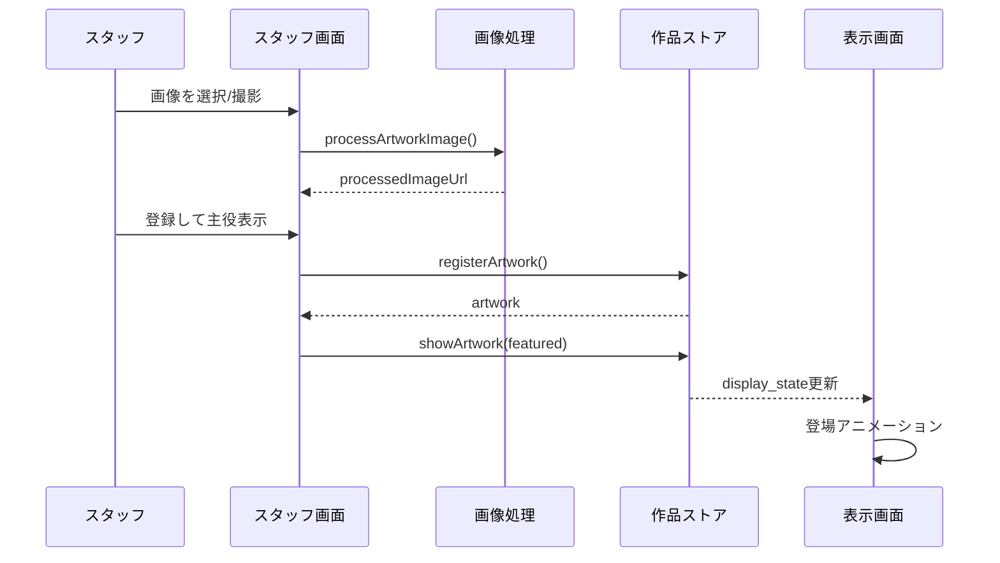
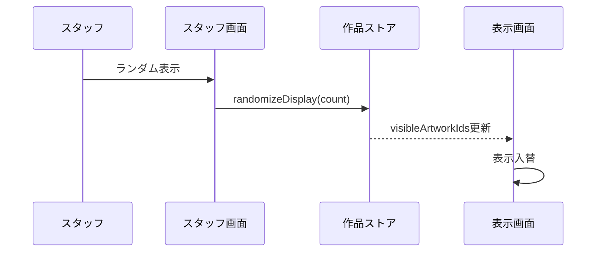
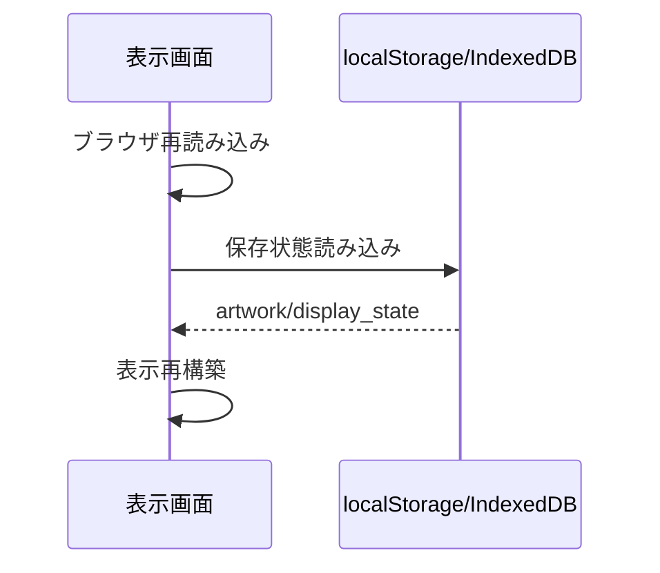

# 03-03 シーケンス図

> 最終更新: 2026-06-23

## 作品登録から表示

```mermaid
sequenceDiagram
  participant Staff as スタッフ
  participant UI as スタッフ画面
  participant Processor as 画像処理
  participant Store as 作品ストア
  participant Display as 表示画面

  Staff->>UI: 画像を選択/撮影
  UI->>Processor: processArtworkImage()
  Processor-->>UI: processedImageUrl
  Staff->>UI: 登録して主役表示
  UI->>Store: registerArtwork()
  Store-->>UI: artwork
  UI->>Store: showArtwork(featured)
  Store-->>Display: display_state更新
  Display->>Display: 登場アニメーション
```

## ランダム表示

```mermaid
sequenceDiagram
  participant Staff as スタッフ
  participant UI as スタッフ画面
  participant Store as 作品ストア
  participant Display as 表示画面

  Staff->>UI: ランダム表示
  UI->>Store: randomizeDisplay(count)
  Store-->>Display: visibleArtworkIds更新
  Display->>Display: 表示入替
```

## リロード復旧

```mermaid
sequenceDiagram
  participant Display as 表示画面
  participant Storage as localStorage/IndexedDB

  Display->>Display: ブラウザ再読み込み
  Display->>Storage: 保存状態読み込み
  Storage-->>Display: artwork/display_state
  Display->>Display: 表示再構築
```

