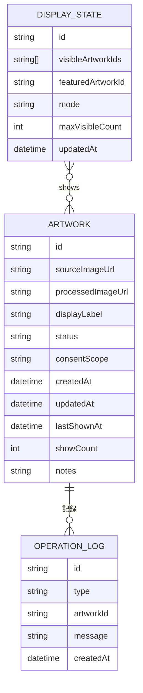

# 02-03 ER図

> 最終更新: 2026-06-23

```mermaid
erDiagram
  ARTWORK ||--o{ OPERATION_LOG : 記録
  DISPLAY_STATE }o--o{ ARTWORK : shows

  ARTWORK {
    string id
    string sourceImageUrl
    string processedImageUrl
    string displayLabel
    string status
    string consentScope
    datetime createdAt
    datetime updatedAt
    datetime lastShownAt
    int showCount
    string notes
  }

  DISPLAY_STATE {
    string id
    string[] visibleArtworkIds
    string featuredArtworkId
    string mode
    int maxVisibleCount
    datetime updatedAt
  }

  OPERATION_LOG {
    string id
    string type
    string artworkId
    string message
    datetime createdAt
  }
```

## 補足

- `DISPLAY_STATE` は常に1件の状態を表す。
- `ARTWORK.status = hidden` の作品はランダム表示候補から除外する。
- SNS転用可否は `consentScope` で分離する。

