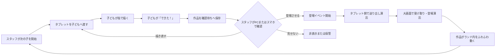

# 業務フロー

## 1. 来場前の獲得フロー

```text
[Instagram投稿]
    │ コメント / プロフィール / DM
    ▼
[IG Harness]
    │ 特典案内・LINE導線・source付与
    ▼
[LINE友だち追加]
    │ Webhook登録・あいさつ
    ▼
[LINE Harness]
    │ タグ・流入元・シナリオ
    ▼
[すわぷよ LIFF]
    │ 認証・友だち確認
    ▼
[ゲーム / 体操 / アンケート]
```

## 2. 初回利用フロー

```text
LIFF起動
  ├─ 初期化失敗 → 再試行 / 通常Web説明
  ├─ 未ログイン → LINE Login
  ├─ 未友だち → 追加理由 → 友だち追加 → 再確認
  └─ 友だち済み
          ↓
     サーバーでLINEトークン検証
          ├─ 失敗 → セッションを発行しない
          └─ 成功 → 内部利用者ID・セッション発行
                         ↓
                   30秒の歓迎体験
                         ↓
             任意アンケート / 今は遊ぶ
                    │             │
                    └──────┬──────┘
                           ▼
                         ゲーム
```

## 3. ゲーム・体操・継続フロー

```text
ゲーム開始
  ↓
1〜2分遊ぶ
  ↓
体操タイム（手動または自然な幕間）
  ├─ スキップ → ゲームへ戻る
  └─ 実施
       ↓
     完了イベント保存
       ↓
     回数・今日のミッション更新
       ↓
     キャラクターの短い祝い
       ├─ 今日登場した仲間を表示
       ├─ たいそうのきろく
       └─ ゲームへ戻る
```

## 4. アンケートと特典フロー

```text
キャラクター「村の仲間を教えて」
  ↓
1画面1問（選択肢をタップ）
  ↓
選択のたびに家族の村アイコンが増える
  ↓
回答完了
  ├─ 保存失敗 → 端末キュー、登場状態は仮保存
  └─ 保存成功 → キャラ登場を確定
                    ↓
              登場演出は3秒以内
                    ↓
                すぐ遊べる
```

## 5. 出展者紹介・送客フロー

```text
体操完了 / ミッション達成 / 会場マップ
  ↓
関連ブースカード（任意・スキップ可）
  ↓
紹介表示イベント
  ├─ 閉じる
  ├─ 会場マップで見る
  ├─ SNSを見る
  └─ 詳細を見る
          ↓
       CTAイベント
          ↓
   出展者レポートへ集計
```

## 6. 運営業務フロー

```text
公開前:
アカウント設定 → コンテンツ登録 → シナリオ下書き
→ テストアカウント送信 → 承認 → 公開

公開中:
ヘルス確認 → 失敗監視 → 必要時停止
→ 日次の利用・体操・流入確認

終了後:
集計確定 → 個人情報を除外 → 出展者レポート生成
→ 人が内容確認 → 共有 → 次回改善へ反映
```

## 7. 当日お絵描き・ランド登場フロー



- タブレットは子ども用お絵描きだけを表示する。
- スタッフの主操作端末はPCとし、同じ管理機能をスマホでも利用できる。
- 完成作品は`確認待ち`を経由し、スタッフ確認前に大画面へ公開しない。
- 登場演出はタブレットから大画面へ作品が移動したと子どもが理解できる連続表現にする。
- 1人あたりの目標所要時間は短時間とし、具体値は3歳頃から小学生までの実機テストで確定する。
