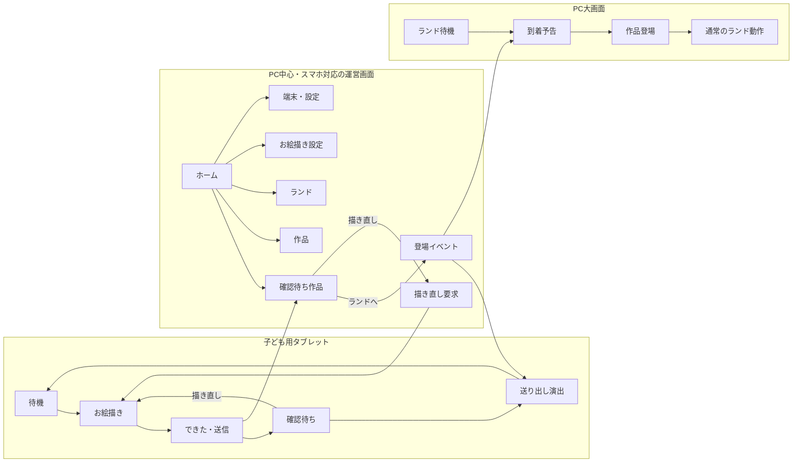

# 画面遷移

## 1. 利用者向け全体

```text
[LINEトーク]
   │ あいさつ / リッチメニュー
   ▼
[起動・認証]
   ├ 未友だち → [友だち追加] ─┐
   ├ エラー   → [再試行]      │
   └ 成功 ────────────────────┘
             ▼
        [初回歓迎]
          ├ 今すぐ遊ぶ ─────────────┐
          └ 村の仲間を教える         │
                    ▼                │
             [家族アンケート]        │
                    ▼                │
             [キャラ登場]            │
                    └────────────────┤
                                     ▼
                                  [すわぷよホーム]
                   ┌─────────────────┼─────────────────┐
                   ▼                 ▼                 ▼
                [ゲーム]     [すわぷよ内のきろく]  [むら]
                   │                 │                 │
              [体操幕間]       [ミッション]      [ブース一覧]
                   │            [種類別回数]       [キャラ一覧]
                   ▼                 │                 │
              [完了祝い] ────────────┘                 │
                   └──────────── [関連ブース紹介]       │
                                           └──── [会場マップ]
```

すべての利用者画面は共通の友だち追加・認証ゲートを通る。マップだけを通常Webで公開する例外は設けない。

初回歓迎には利用同意ステップ（画面-018）を含む。同意記録前に利用者データを保存しない。同意文面・撤回は保護者メニューから常時到達できる。

## 2. 出展者・運営画面

```text
[出展者専用URL]
  → [認証]
  → [出展者サマリー]
      ├ 流入
      ├ 紹介・CTA
      ├ ゲーム・体操との接点
      └ 定性メモ

[運営URL]
  → [管理者認証]
  → [運営ダッシュボード]
      ├ 利用状況
      ├ コンテンツ管理
      ├ 出展者管理
      ├ LINE / IG連携状態
      ├ エラー・再送
      └ レポート出力
```

MVPの集計閲覧デモでは認証ステップを置かず、推測不能URL＋集計値のみ＋書込系非公開で運用する（決定-020）。当日お絵描きの作品・ランド・設定書込はこの例外に含めず、要確認-007で確定する運営認証を必須とする。

### 2.1 当日お絵描き・ランド運営



子ども用タブレットには運営画面へのリンクを表示しない。運営画面は同一route群をPCとスマホで利用し、PCでは複数ペイン、スマホではタブと1カラムへ再配置する。

## 3. 戻る操作

- LIFFの閉じる操作とアプリ内戻るを混同させない。
- アンケートは前の回答へ戻れる。
- ゲーム中の戻るは確認sheetを出し、進行を保存する。
- 外部リンクは新しいブラウザへ移動することを明示する。
- 戻る操作でLINEログインや回答送信を重複実行しない。

## 4. ディープリンク

| パス例 | 用途 | 未認証時 |
|---|---|---|
| `/` | ホーム | 認証後にホーム |
| `/play` | ゲーム | 認証後にゲーム |
| `/progress` | きろく | 認証後にきろく |
| `/onboarding` | 家族オンボーディング | 認証後に対象質問 |
| `/village/booths` | ブース一覧・詳細sheet | 認証後に一覧 |
| `/village/map` | 会場マップ | 認証後にマップ |
| `/claim?token=:token` | キャラ引換（QR→LINE連携） | 認証後に引換確認。LIFF経由は `https://liff.line.me/{LIFF_ID}?claim=:token` |
| `/reports/exhibitors/:id` | 出展者レポート | 出展者認証へ |
| `/fuwafuwa/draw` | 子ども用お絵描き | 子ども用キオスク状態へ。運営routeへのリンクを表示しない |
| `/staff` | 運営ホーム | 運営認証へ。PC主対象、スマホ対応 |
| `/staff/artworks` | 作品管理 | 運営認証へ |
| `/staff/land` | ランド操作 | 運営認証へ |
| `/staff/drawing` | お絵描き設定 | 運営認証へ |
| `/staff/devices` | 端末・設定 | 運営認証へ |
| `/display` | 大画面ふわふわランド | 表示端末の接続境界へ |

クエリの`source`、`campaign`、`content`は許可済み文字列へ正規化し、任意URLやLINE識別子を受け付けない。
