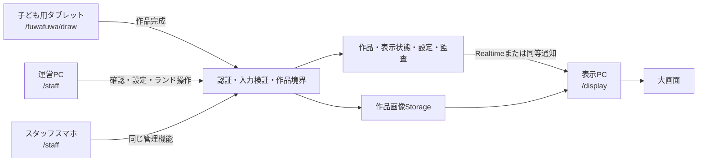

# システム概要・構成図

## 1. 構成方針

Cloudflareは配信・API・外部Webhookの実行基盤、Supabaseはプロダクトデータの正本、各HarnessのD1はチャネル運用データの正本とする。

```text
                         ┌──────────────────┐
Instagram利用者 ────────→│ IG Harness       │
                         │ Worker + D1 + R2 │
                         └────────┬─────────┘
                                  │ source付きLINE導線
                                  ▼
┌──────────┐   Messaging API  ┌──────────────────┐
│ LINE利用者│←────────────────→│ LINE Harness     │
└────┬─────┘                   │ Worker + D1      │
     │ LIFF                    └────────┬─────────┘
     ▼                                │ 必要な運用イベントのみ
┌──────────────────────────────────────▼─────────┐
│ Cloudflare                                    │
│                                               │
│ Pages / Workers Assets                        │
│  └ React + Vite + PixiJS（画面・ゲーム）      │
│                                               │
│ Product Worker API                            │
│  ├ LINEトークン検証                           │
│  ├ セッション                                 │
│  ├ アンケート・進捗・イベントAPI              │
│  ├ 出展者レポートAPI                          │
│  └ Webhook受信・署名検証・重複排除            │
└──────────────────────┬─────────────────────────┘
                       │ サーバー間アクセス
                       ▼
              ┌────────────────────┐
              │ Supabase           │
              │ Postgres / Storage │
              │ プロダクトSSoT     │
              └────────────────────┘
```

Product WorkerからSupabaseへはPostgREST（REST）経由でアクセスし、エッジからの直接TCP接続を行わない（コネクション枯渇防止）。直接SQL接続が必要になった場合はHyperdrive等のpooler経由を条件とする。

### 当日お絵描き・ランド運営



- PCを運営管理の主端末とし、スマホは同じ運営画面をレスポンシブ表示する。
- タブレットはお絵描き専用とし、運営管理の認証情報・route・操作を持たせない。
- 表示PCはview専用とし、作品・設定の変更を行わない。
- 現行試作はSupabase Storage / Postgres / RealtimeとIndexedDBキャッシュを利用している。PC・スマホからの書込を本番化する前に、要確認-007で運営認証を確定し、匿名の広い書込権限を残さない。
- 会場回線断時の端末間同期は、表示済み作品の継続と新規作品の端末内退避を分けて扱う。ローカル同期方式は要確認-013で確定する。

## 2. 責務

| コンポーネント | 責務 | 持たせないもの |
|---|---|---|
| React/Vite | LIFF UI、ゲーム、表示状態、端末キュー | LINE secret、service role、信頼済み本人判定 |
| Product Worker | 認証、認可、入力検証、DB操作、集計 | ゲーム描画、長期コンテンツ資産 |
| Supabase | 利用者、同意、回答、進捗、出展者、イベント | LINE配信シナリオ、IG DM全文 |
| LINE Harness D1 | LINE友だち、タグ、配信、会話、Webhook | ゲーム進捗・家族アンケートの正本 |
| IG Harness D1/R2 | IGフォロワー、DM、ゲート、画像キャッシュ | 家族・体操・出展者レポートの正本 |
| LINE Platform | LINE Login、友だち状態、メッセージ | アプリの業務データ |

## 3. 認証方式

### 利用者

1. LIFF SDKがID tokenまたはaccess tokenを取得する。
2. ブラウザはトークンをProduct Workerの`/api/auth/line`へ送る。
3. WorkerはLINE公式APIでtoken、audience、期限を検証する。
4. `sub`からサーバー側HMACキーで`subject_key`を生成する。
5. 内部利用者をupsertし、HttpOnlyセッションcookieを発行する。
6. 以後のAPIは内部利用者IDだけを扱う。
7. （P1・機能-407）認証成功時、Workerは検証済みLINE user IDとproduct refをLINE Harnessの名簿へupsertする。Supabaseには不可逆化した`subject_key`のみ保存し、生LINE IDを渡さない（決定-011。詳細は`04_詳細設計/02_Harness連携仕様.md`）。

セッションの仕様:

- 寿命は24時間のスライディング延長（最終アクセスで更新）とする。
- cookie属性は`HttpOnly` `Secure` `SameSite=Lax` `Path=/`。
- 失効時（401）はLIFF再認証を自動実行し、進行中のゲーム・未送信キューを失わない。

LINEのID tokenをSupabase Authへ直接渡す方式はMVPで採用しない。Product Workerを認証境界とし、個人データへのブラウザ直アクセスを避ける。

### 出展者・運営

MVP（8/2デモまで）は認証なしで運用する（決定-020）。ただし次の成立条件を必須とする。

- 表示するのは集計値のみ（少数セル秘匿済み）。個票・個人を特定できる情報を認証なし画面へ出さない。
- レポートURLは推測不能なUUIDパスとし、公開の場に掲載しない。
- 書込系の管理API（再送、スナップショット生成等）は本番URLへ公開せず、ローカル/preview環境からのみ実行する。
- イベント後の実運用移行をもって認証導入を必須Gateとする（方式は要確認-007。fail-closed＝未設定時全拒否を必須条件とする）。
- 認証導入時も利用者セッションと管理者セッションを共有せず、出展者は割り当てられた`exhibitor_id`だけを閲覧する。

決定-020の認証なし運用は、集計値の閲覧デモに限る。作品公開、非表示、ランド操作、お絵描き設定等の書込機能には適用しない。PC・スマホの当日運営書込は、要確認-007で確定する同一の運営認証を必須とし、未設定時はfail-closedとする。

## 4. 配信方式

- MVPはCloudflare Pages + Pages Functionsを第一案とし、既存Viteアプリの静的成果物と同一オリジンAPIを配信する。
- `/api/*`は同一オリジンのPages Functionsへルーティングする。制約が判明した場合のみWorker Static Assets案を比較する。
- LIFF Endpoint URLは本番HTTPS URLの固定パスとする。
- Preview URLを本番LIFFへ設定しない。
- SPAのパス直アクセスをCloudflare側で`案内.html`へフォールバックする。
- **現況(2026-07-12)**: Cloudflare Pagesプロジェクト`suwapuyo`(`suwapuyo.pages.dev`)は作成済み・稼働中。git連携はまだ設定しておらず、`npx wrangler pages deploy dist --project-name=suwapuyo --branch=main`による手動デプロイで運用している。Vercel上の同名プロジェクトは初期デモ期の残置物でgit push契機の自動デプロイが生きているが、本番配信先はCloudflareでありVercelではない。誤認防止のため、デプロイ状況の確認は必ず`npx wrangler pages deployment list --project-name=suwapuyo`で行う。

## 5. 既存実装の扱い

| 資産 | 方針 |
|---|---|
| PixiJSゲームエンジン | 再利用。描画と画面UIを分離する |
| 体操モーダル | 進行ロジックを再利用し、画面を再設計する |
| `progressStore` | オフラインキャッシュ層へ位置付け直す |
| `visitorStore` | デモ用fallbackとして残し、Repository経由にする |
| 初回の体験設定 | 画面遷移の土台だけ再利用し、旧party・人数・性別・流入元・健康関係者ステップを新しい3問へ置換する |
| 出展者レポート | チャート部品を再利用し、実集計APIへ接続する |
| `track()` | noopを廃止し、冪等イベントAPIへ差し替える |
| `DigitalCanvas` | pointer描画の土台を再利用し、子ども専用画面へ分離。カメラ・画像upload・同意・公開先を混在させない |
| `StaffPanel` / `RegisterForm` | 現行の混在画面は完成UIとして採用せず、運営ホーム・作品・ランド・お絵描き設定・端末設定へ分割する |
| `ArtworkRepository` / `DisplayStateService` | Repository境界を維持し、二重登場防止・認証・監査・競合制御を追加する |
| `DisplayScreen` / `FuwafuwaWorld` | 表示専用を維持し、作品到着イベントから登場演出、通常ランド動作へ遷移させる |

## 6. 障害分離

| 障害 | 継続できること | 停止すること |
|---|---|---|
| IG Harness停止 | LINE・LIFF・ゲーム | IG DM・コメント導線 |
| LINE Harness停止 | LIFF直接起動済みゲーム | 配信・CRM自動化 |
| Supabase停止 | 端末内ゲーム、未同期キュー | クラウド進捗・レポート更新 |
| LINE Login停止 | 既存有効セッションの範囲 | 新規認証・友だち再確認 |
| Cloudflare停止 | なし | アプリ配信・API |
| 会場インターネット停止 | 表示済み作品のランド描画、端末内お絵描き、未送信作品の保持 | クラウド経由の新規作品共有。ローカル同期方式確定後は範囲を更新 |
| タブレット切断 | 表示中ランド、PC・スマホでの既存作品管理 | 新しいお絵描き受付 |
| 表示PC切断 | タブレット描画、作品の確認待ち保存 | 大画面の新規登場。復帰後に未反映イベントを再取得 |
