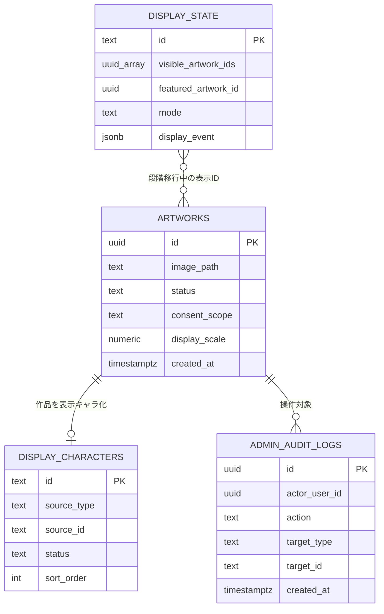

# ER図

## 1. プロダクトデータ

```text
┌───────────────┐      1      n ┌─────────────────┐
│ app_users     │───────────────│ user_identities │
│ PK id         │                │ provider        │
└───────┬───────┘                │ subject_key     │
        │                         └─────────────────┘
        │1
        ├────────────n consent_記録
        │
        ├────────────1 family_profiles ───────n family_children
        │
        ├────────────n survey_responses
        │
        ├────────────n game_sessions
        │                    │1
        │                    └────────n exercise_completions
        │
        ├────────────n exercise_completions
        │
        ├────────────n character_arrivals
        │
        ├────────────n mission_progress n────────1 missions
        │
        ├────────────n product_events
        │
        └────────────n app_sessions
```

## 2. 出展者・キャンペーン

```text
campaigns 1────────n exhibitor_コンテンツs n────────1 exhibitors
    │                        │1                           │
    │1                       └──n booth_rotation_counters │
    ├────────n product_events                            │1
    │                                                    │
    └────────n report_スナップショット n────────────────────────┘
```

## 3. Harnessとの境界

```text
LINE Harness D1                    Supabase
┌────────────────┐                ┌─────────────────┐
│ LINE friends    │                │ app_users       │
│ tags/scenarios  │──明示連携キー→│ user_identities │
│ messages        │                │ product_events  │
└────────────────┘                └─────────────────┘

IG Harness D1/R2
┌────────────────┐
│ IG followers   │
│ DM/gates       │──source/明示連携キーのみ──→ Supabase
│ cross-links    │
└────────────────┘
```

DBを物理的に1つへ統合するのではなく、業務責務ごとに正本を1つだけ決める。横断分析が必要な値は、個票の全同期ではなく、署名済みイベントまたは限定的な外部IDリンクで渡す。

セグメント配信では、Supabaseがproduct refとタグ名だけをHarnessへ渡し、生LINE IDへの解決はLINE Harness D1側で行う（決定-011。詳細は`04_詳細設計/02_Harness連携仕様.md`）。

## 4. 削除

```text
app_usersを論理削除
  ↓
セッション失効
  ↓
identity切断
  ↓
家族回答・個別進捗を削除または匿名化
  ↓
集計済みレポートは再識別不能な値のみ保持
```

保持は無期限（アカウント有効な間。決定-018）。削除依頼時の物理削除はバックアップ世代の失効をもって完了とし、集計済みレポートは再識別不能な値のみ保持する。

## 5. 当日作品・ランド表示



`display_characters`への移行中は`display_state.visible_artwork_ids`との互換を保つが、両方を恒久的な表示正本にしない。運営設定と端末heartbeatの物理エンティティは未確定であり、本ERへ推測で追加しない。
