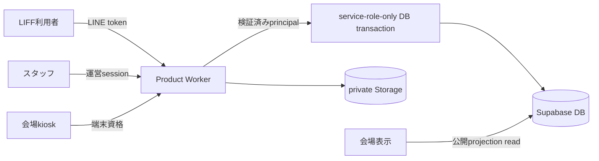

# 認証・承認境界再設計（SUW-28 / SUW-30）

> 状態: **設計ドラフト（未承認・DB未適用）**
>
> 作成日: 2026-07-19
>
> 対象: おえかきkiosk、スタッフ画面、LIFF、キャラ受取、体操記録、ブース体験
>
> 実装Gate: SUW-03（運営認証方式）と本書の未確定事項を木幡さんが承認するまで、migration・本番設定・認証配線を実行しない。

## 1. 目的と利用者価値

会場の子どもが描いた絵を、スタッフが明示的に承認したときだけ安全に会場画面へ表示し、本人のLINEアカウントへ取り違えなく渡せるようにする。同時に、来場者の体操・ブース体験を、匿名ブラウザから改変できない利用者単位の記録へ移行できる境界を作る。

## 2. 2026-07-19時点の実態

| 領域 | 実装済み | 未実装・仮実装 | 判定 |
|---|---|---|---|
| おえかきkiosk | hidden登録、スタッフUI、Realtime表示、送信後導線、undo/resize、`/staff/*` deep link | 登録・承認のDB transaction、運営本人性、private画像配信 | ローカルUI修正済み。承認境界は未完成 |
| LIFF | SDK初期化、ログイン・友だち追加Gate、deep link解析 | LINE tokenのサーバ検証、内部利用者session | 画面Gateのみ。認証済みAPI境界ではない |
| キャラ受取 | token/RPCのmigration案、QR modal、連携client | `ClaimScreen`の実処理、検証済み利用者との紐付け | 未完成。現migrationは適用禁止 |
| お口体操 | 30秒周期、10種、スキップ不可のUIとunit test | 専門家監修、実機音声/タイマー、利用者DB記録 | 体験デモ段階 |
| ブース紹介 | 一覧・詳細・検索、仮チェックイン/スタンプ/感想 | 正式出展者台帳、会場位置、サーバ保存、集計権限 | UIデモ段階。現記録は端末内 |
| DB | 作品・表示・CMSのSupabase tables | 利用者/session/family/exercise/boothの物理schema | 画面系DBと認証系DBが未接続 |

## 3. 現行設計で本番適用してはいけないもの

### 3.1 claim migration

`202607190002_create_character_claim.sql`は次の理由で本番適用しない。

- `anon`がclaim tokenを一覧・発行・更新できる。
- `claim_character`と`list_my_characters`が、ブラウザから渡されたLINE user IDを本人性の根拠にしている。
- `security definer`関数を`anon`が実行できる。
- tokenが平文の主キーで、漏えい時の被害を限定できない。
- LINE user IDを直接保存する設計で、内部利用者IDへの分離がない。

### 3.2 既存RLSとStorage

現行migrationには、`anon`による作品・表示状態・表示キャラ・CMS等の更新許可と、公開`artworks` bucketが含まれる。会場端末の利便性を認可の代替にしており、URLを知る任意の利用者と正規kioskを区別できない。SUW-30ではブラウザからのSupabase直接書込を廃止し、公開表示に必要な限定read以外を閉じる。

### 3.3 migration適用順

`202607190001`、`202607190002`、`202607190003`を一括適用しない。特に`0002`は再設計で置換する。SUW-31はSUW-03・SUW-30・キャラ受取の実装完了後まで停止する。

## 4. 固定する共通境界

SUW-03で運営認証方式のA/B/Cのどれを選んでも、次は共通とする。

1. ブラウザへSupabase service role keyを渡さない。
2. 作品登録、承認、claim、体操・ブース記録はProduct Workerだけが受け付ける。
3. Workerは利用者session、運営session、kiosk端末資格を別のprincipalとして扱う。
4. DB書込はservice-role-only関数または同等のサーバ専用経路に限定する。
5. `anon`は公開表示用projectionのreadだけにする。
6. Storageはprivate化し、表示対象にだけ短寿命URLを発行する。
7. 監査・冪等性は端末のIndexedDBではなくサーバ側へ置く。
8. 障害・rollback時は書込停止へ倒し、`anon`全面開放へ戻さない。

## 5. kiosk登録と承認のtransaction

### 5.1 表示の正本

`display_characters.status = 'visible'`を表示membershipの正本にする。`display_state.visible_artwork_ids`への新規書込は停止し、互換読取を廃止できた時点で削除する。`artworks.status`は作品workflow、`display_state`は表示mode・featured・上限等の設定を表す。

### 5.2 登録

1. Workerが入力、画像形式・サイズ、kiosk資格、operation IDを検証する。
2. private Storageへ一時objectをuploadする。
3. DB transactionで`artworks(status=hidden)`と対応する`display_characters(status=hidden)`を同時作成する。
4. DB失敗時は一時objectを補償削除する。削除失敗は監査へ残し、公開しない。
5. 同じoperation IDの再送は同じ結果を返す。

### 5.3 承認

概念上のサーバ専用操作を`approve_artwork_for_display`と呼ぶ。物理関数名・request/responseはSUW-03決定後にOpenAPIとmigrationで確定する。

transaction内の順序:

1. operation IDのadvisory lockと既存receipt確認。
2. `display_state(id='current')`、対象`artworks`、対象`display_characters`の順にrow lockを取る。
3. 作品とキャラがともにhiddenで、対応関係が一致することを検証する。
4. `artworks.status='queued'`と`display_characters.status='visible'`を同一transactionで更新する。
5. 必要な場合だけfeatured/modeを更新する。`visible_artwork_ids`は更新しない。
6. actor、対象、前後状態、operation ID、結果を中央監査表へ保存する。
7. 途中の0行更新・constraint違反・監査失敗は全体rollbackする。

同一operation ID・同一入力は保存済み結果を返す。異なる入力での再利用はconflictにする。全ての書込関数は`PUBLIC`、`anon`、一般`authenticated`からexecuteをrevokeし、Workerのservice roleだけに許可する。

### 5.4 表示上限

現行表示コードには、設定された`max_visible_count`ではなくvisible件数から上限を導く箇所があり、30件超で新規承認作品が表示されない可能性がある。通常承認時に古い作品を退場させるか、上限超過を拒否するかは未決定である。決定までは「featured表示だけを更新し、通常枠を自動退場させない」を安全側の暫定案とする。

## 6. LIFF利用者sessionとclaim

### 6.1 利用者session

1. LIFF clientはLINEのID tokenまたはaccess tokenをWorkerへ渡す。
2. WorkerがLINE公式endpointで署名・issuer・audience・期限を検証する。
3. WorkerはLINE subjectをサーバ秘密鍵でHMAC化し、内部`user_id`へ対応付ける。
4. ブラウザへ短寿命・Secure・HttpOnly・SameSiteを設定した内部sessionを発行する。
5. 以後のAPIは自己申告`line_user_id`を受け取らず、sessionの内部`user_id`を使う。

友だち追加状態はサービス利用条件であり、本人認証と同一視しない。

### 6.2 claim

- QRには高entropyのraw tokenを一度だけ載せ、DBにはhashだけを保存する。
- previewはtokenを消費しない。
- claim確定は認証済み内部`user_id`を所有者として、token消費とownership作成を一transactionで行う。
- 同一利用者の再送だけを冪等成功にし、別利用者からの再利用は拒否する。
- token一覧・発行・失効は運営sessionだけに許可する。
- raw LINE user IDは業務tableへ保存しない。

## 7. 運営認証の選択肢（SUW-03）

| 案 | 構成 | 長所 | 主な運用負荷 | 推奨 |
|---|---|---|---|---|
| A | Supabase Auth magic link + Worker session | アプリ内で完結しやすい | 共有端末のmail導線、session終了、退職時失効の設計が必要 | 可 |
| B | Cloudflare Access + WorkerでAccess JWT検証 | `/staff*`と管理APIを入口から閉じやすく、現行Cloudflare構成と整合 | Access policy、許可mail、緊急解除手順の管理が必要 | **推奨** |
| C | 独自password + 2FA | 独自要件へ対応可能 | password保管、回復、2FA、監査を自前運用するため最も重い | 非推奨 |

どの案でも、画面routeを隠すだけでは認可にならない。`/api/admin/*`の各requestで運営principalと権限を検証する。

## 8. 対象データの論理分離

物理schemaはGate後にDB由来の定義を正本として作る。必要な責務は次のとおり。

| データ | 所有・アクセス境界 |
|---|---|
| 利用者identity/session | Workerのみ。LINE subjectと業務データを直接結合しない |
| family/child profile | 認証済み保護者session。年齢境界・同意・削除仕様の確定が先 |
| exercise event | 利用者session単位。子どもへの紐付けはONBOARD-303確定後 |
| booth visit/feedback | 利用者sessionまたは署名済みevent。出展者は少数値保護済み集計だけ |
| artwork/display | kiosk登録、運営承認、公開projection readを分離 |
| character ownership | claim transactionだけが作成。本人は自分のownershipだけread |
| admin audit | 追記専用。actor、operation、対象、前後、結果を保持 |

現時点のrepositoryには、利用者session、family、exercise、booth eventの本番物理schemaはない。localStorage/IndexedDBのデモ記録を本番DB実装済みとして扱わない。

## 9. 移行とrollback

### Phase 1: expand

- Workerと内部principalを追加する。
- private bucket、公開projection、新しいhash claim、監査・operation receiptを旧経路と分離して追加する。
- 既存画面はまだ切り替えず、権限テストを先に通す。

### Phase 2: migrate

- kiosk、staff、LIFF、claimの順にWorker APIへ切り替える。
- 既存作品をhidden/visibleの対応関係へ整合させる。
- signed URLとRealtime/public projectionの表示を縦貫通確認する。

### Phase 3: contract

- `anon`書込と危険なRPC executeをrevokeする。
- public Storageを閉じる。
- 旧claim table/functionと`visible_artwork_ids`互換経路を、利用が0である証拠を確認後に削除する。

rollbackはWorker書込停止・旧データread-onlyを基本とする。旧anon書込policyや自己申告LINE IDのRPCを復活させない。

## 10. 受入条件

### transaction・並行性

- hidden作品は公開projectionとsigned URLから取得できない。
- 承認成功時だけ作品とキャラが同時に表示可能になる。
- 作品更新、キャラ更新、表示設定、監査の各段階を故意に失敗させても部分更新が残らない。
- 同一operation再送、同時二重承認、承認と非表示の競合が決定的な結果になる。
- 異なる入力で同じoperation IDを使うと拒否される。
- 上限到達時の挙動が承認済み仕様どおりで、新規作品が無言で消えない。

### 認証・認可

- 未認証、期限切れ、別audience、改変LINE tokenを拒否する。
- 利用者sessionで管理APIを実行できず、運営sessionで別利用者の私有データを直接読めない。
- `anon`から全write/RPCを拒否し、公開projection以外を読めない。
- claim tokenをDB・ログ・URL analyticsへ平文保存しない。
- 別利用者による使用済みtoken再利用を拒否する。

### 縦貫通

- kiosk登録 → hidden確認 → スタッフ承認 → 会場表示 → QR発行 → LIFF本人claim → 自分のキャラ一覧、を正常系・異常系で確認する。
- LIFFの体操完了とブース訪問は認証済み利用者へ記録され、再送で二重加算されない。
- private画像のURL期限切れ、オフライン再送、Worker timeout時に公開・二重記録が起きない。

## 11. 未確定Gate

1. **SUW-03**: 運営認証A/B/C。推奨はB（Cloudflare Access）。
2. 通常表示が上限に達した場合の退場方針。
3. kiosk端末資格の配布・失効・オフライン運用。
4. ONBOARD-303の子ども単独利用と保護者確認年齢。
5. 体操内容の専門家監修と、子ども単位で保存する範囲。
6. ブース正式台帳・位置・出展者へ返す最小集計単位。

これらを決める前に、物理DB schema、migration、OpenAPI、本番policyを確定しない。
