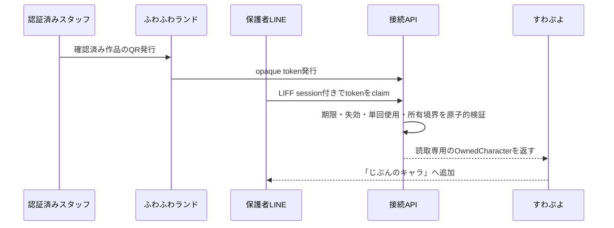
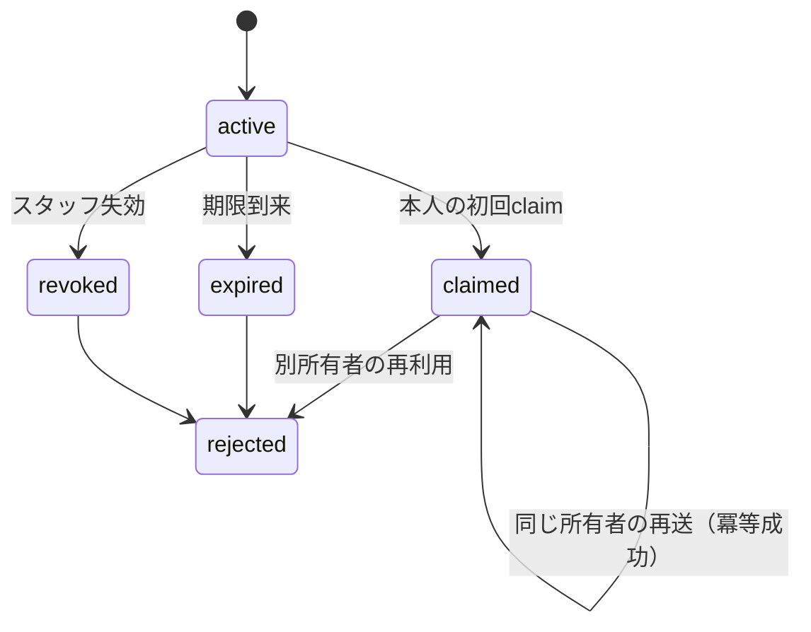

# すわぷよ・ふわふわランド接続 — 実装状態と契約

> 基準日: 2026-07-21
> 責務: ふわふわランドの作品キャラを、本人の明示操作で安全にすわぷよへ受け渡す
> 本番判定: **入口とクライアント土台のみ／本番配線禁止**

## 1. 接続は第三の独立境界

すわぷよ本体も、ふわふわランド本体も、接続機能が停止していて単独利用できなければならない。接続障害をゲーム停止やランド停止へ波及させない。



## 2. 所有権

| 対象 | 正本・所有者 |
|---|---|
| 原作品画像・公開状態 | ふわふわランド |
| 表示キャラ・ランド内設定 | ふわふわランド |
| claim token・使用/失効状態 | 接続機能 |
| LINE本人確認・内部session | すわぷよ認証基盤 |
| すわぷよ内の所有キャラ参照 | すわぷよ |

すわぷよはランドの内部tableへ直接書き込まない。ランドはLINE user IDを受け取らない。接続APIは両者へ必要最小限の識別子だけを渡す。

## 3. 契約

### 入力

- `opaqueToken`: 推測不能。作品ID・氏名・LINE IDを含めない。
- `session`: Workerが検証済みの内部session。クライアント自己申告IDを受け付けない。
- `requestId`: 冪等性と監査のための一意ID。

### 出力

```text
OwnedCharacter
├─ characterId       接続境界で安定したopaque ID
├─ displayName       許可済み表示名
├─ imageUrl          許可済みread URLまたは署名付きURL
├─ source            fuwafuwa_artwork
└─ linkedAt          server timestamp
```

### 状態遷移



## 4. セキュリティ不変条件

1. tokenだけで所有権を確定しない。検証済みsessionを必須とする。
2. claimは原子的に消費し、同じ利用者・requestIdの再送だけ冪等成功とする。
3. 生LINE ID、子どもの氏名、作品の連番IDをURL・ログへ出さない。
4. QR発行は認証済みスタッフだけが行う。
5. 原作品の非表示・保管後に、すわぷよ側で何を表示するかを明示状態で返す。
6. 監査はtoken平文を保存せず、hash、結果、操作者/所有主体、時刻を記録する。
7. 接続失敗時も、ゲームとランドの単体利用を継続できる。

## 5. 現在地

| 能力 | 状態 | 事実 |
|---|---|---|
| QR表示UI | 実装済み | 運営画面からQRモーダルを開く土台あり |
| claim URL解析 | 実装済み | `claim`、`liff.state`を解析できる |
| `/claim`画面 | プレースホルダー | tokenを読むが「準備中」から進まない |
| Supabase RPC client | 土台あり | `claim_character`、`list_my_characters`関数あり |
| LIFF本人との紐付け | 未実装 | 検証済み内部sessionがない |
| キャラ選択への取込 | 未実装 | buddy/character selectionへ配線されていない |
| 安全なtoken schema | 未確定 | 現行0002はanon自己申告IDのため適用禁止 |
| 所有単位 | 判断待ち | 個人所有か家族共有かを確定する必要がある |

## 6. 本番配線Gate

`SUW-30`のLIFF内部session、Worker管理API、RLS、Storage境界が完成し、キャラ所有単位が木幡さんにより確定するまで、claim RPCとキャラ選択を本番配線しない。

## 7. 完了の定義

認証済みスタッフが発行したQRを、本人がLINEで読み、別人・期限切れ・失効・二重読取を安全に拒否し、成功時だけすわぷよの「じぶんのキャラ」へ一度追加できる。接続停止時も両本体が単独稼働することを異常系で確認して完了とする。
