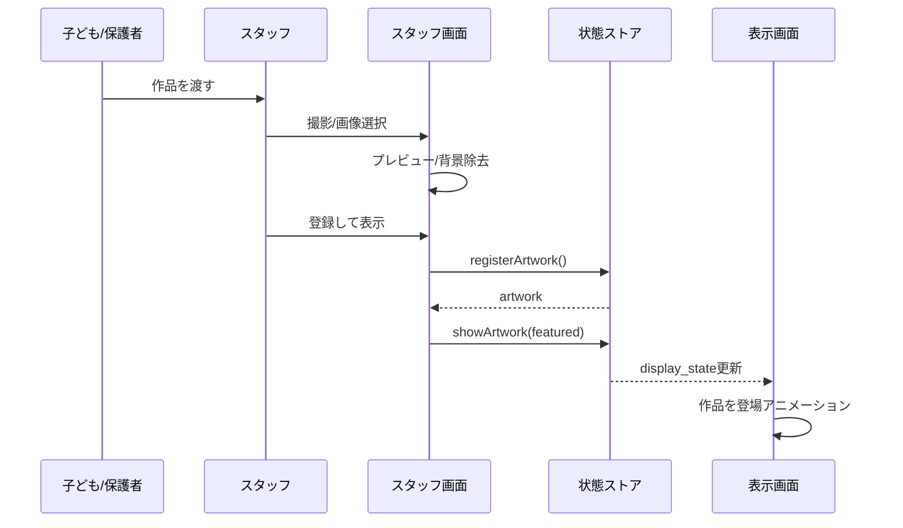
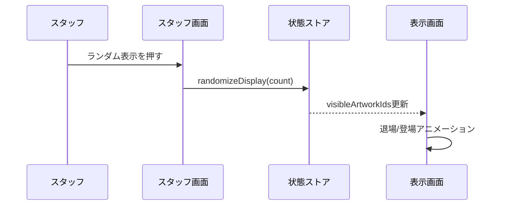
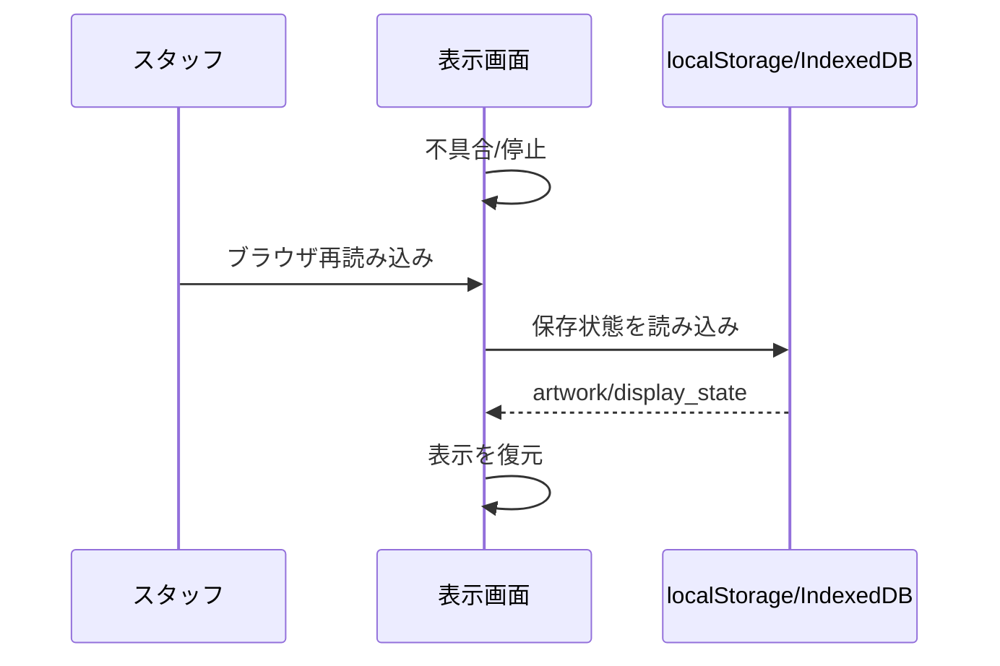

# ふわふわランド 詳細設計 v0.1

> 最終更新: 2026-06-23

## 1. バックエンド処理

### 1.1 MVP方針

2026-06-25 の技術検証ではバックエンドを必須にしない。理由は、可否判断で最も重要なのは以下であり、DBやクラウド連携ではないため。

- 撮影/登録のオペレーション速度。
- 画像処理の安定性。
- PixiJS表示の安定性。
- 6時間運営時の復旧性。

MVPではブラウザ内の状態管理で成立性を確認する。

### 1.2 将来バックエンド

8/2本番でスタッフ端末と表示PCを分ける場合、以下のどちらかを採用する。

#### Supabase案

- Storage: 作品画像。
- Table: artwork/display_state/operation_log。
- Realtime: 表示画面への反映。

利点:

- 実装が速い。
- 管理画面・一覧・履歴と相性がよい。

注意:

- ネットワーク依存。
- 会場Wi-Fi品質の影響を受ける。
- `.env*` 管理が必要。コミット禁止。

#### ローカルWebSocket案

- 表示PCをローカルサーバにする。
- スタッフ端末が同一LANから接続する。

利点:

- クラウド依存が低い。
- イベント現地で完結しやすい。

注意:

- 会場ネットワークで端末間通信が塞がれる可能性。
- セットアップ手順が増える。

## 2. API仕様書

MVPでは内部関数として実装し、将来API化できる形で定義する。

### 2.1 `registerArtwork`

作品を登録する。

入力:

```ts
type RegisterArtworkInput = {
  sourceImageUrl: string;
  processedImageUrl?: string;
  consentScope: 'event_only' | 'sns_allowed' | 'unknown';
  notes?: string;
};
```

出力:

```ts
type RegisterArtworkOutput = {
  artwork: Artwork;
};
```

処理:

1. IDを発行する。
2. 画像を保存する。
3. ステータス `queued` で登録する。
4. operation_log に `register` を記録する。

### 2.2 `showArtwork`

指定作品を表示する。

入力:

```ts
type ShowArtworkInput = {
  artworkId: string;
  mode: 'normal' | 'featured';
};
```

処理:

1. artwork が存在し、`hidden` でないことを確認する。
2. `visibleArtworkIds` に追加する。
3. `mode === 'featured'` の場合は `featuredArtworkId` に設定する。
4. 表示上限を超えた場合、古い作品を待機へ戻す。

### 2.3 `hideArtwork`

作品を非表示にする。

入力:

```ts
type HideArtworkInput = {
  artworkId: string;
  reason?: string;
};
```

処理:

1. artwork.status を `hidden` にする。
2. 表示中なら `visibleArtworkIds` から外す。
3. featuredArtworkId なら解除する。

### 2.4 `resetDisplay`

表示中作品を全てクリアする。

入力:

```ts
type ResetDisplayInput = {
  keepPool: boolean; // trueなら登録作品は残す
};
```

処理:

1. `visibleArtworkIds` を空にする。
2. `featuredArtworkId` を空にする。
3. `mode` を `idle` にする。

### 2.5 `randomizeDisplay`

作品プールからランダム表示する。

入力:

```ts
type RandomizeDisplayInput = {
  count: number;
  includeAlreadyShown: boolean;
};
```

処理:

1. `hidden` 以外の作品を候補にする。
2. `lastShownAt` が古い作品を優先する。
3. 指定数を表示する。

## 3. シーケンス図

### 3.1 作品登録から表示



### 3.2 ランダム入替



### 3.3 復旧



## 4. アーキテクチャ構成図

### 4.1 2026-06-25 技術検証

```txt
Browser
  ├─ React UI
  │   ├─ StaffApp
  │   └─ DisplayApp
  ├─ PixiJS WorldRenderer
  ├─ ImageProcessor
  │   ├─ crop
  │   ├─ white background removal
  │   └─ resize/compress
  ├─ ArtworkStore
  │   ├─ in-memory state
  │   └─ localStorage/IndexedDB
  └─ OperationLog
```

### 4.2 8/2本番候補

```txt
Staff Tablet/PC
  └─ Staff UI
       └─ Upload/Control

Cloud or Local Server
  ├─ artwork store
  ├─ image storage
  └─ realtime channel

Display PC
  └─ Display UI
       └─ PixiJS WorldRenderer

Monitor
  └─ DELL 1台 or 2台連結
```

## 5. 画像処理詳細

### 5.1 入力制約

- 原則A4台紙。
- 白背景。
- キャラ/作品は太めの線で描くことを推奨。
- 撮影時に手・顔・背景物を入れない。
- 台紙四隅にガイドを入れるとトリミング精度が上がる。

### 5.2 白背景除去

初期方式:

1. 画像をCanvasへ描画。
2. RGBが白に近い画素を透明化。
3. 薄い色が消えすぎないよう閾値を保守的にする。
4. 透明化後に余白を検出してトリミング。
5. 長辺を一定サイズへ縮小。

リスク:

- 薄い黄色/水色/ピンクが消える可能性。
- 影が背景として残る可能性。
- 白以外の机や床が写ると失敗する。

対策:

- 撮影台を白マットにする。
- 台紙の外側を写さない。
- 失敗時は背景除去せず四角画像として表示する。

## 6. 表示ロジック詳細

### 6.1 同時表示数

100〜200体同時表示は採用しない。理由:

- 一般的なDELLモニター1台/2台では作品が小さくなり、自分の作品を見つけにくい。
- イベント体験として「出てきた！」の瞬間が弱くなる。
- 作品同士の重なり・視認性・スタッフ説明が悪化する。

推奨:

- 標準: 12体。
- 混雑時: 16〜20体。
- 最大検証: 30体。

### 6.2 表示モード

| モード | 用途 | 表示 |
|---|---|---|
| idle | 作品がない/休止 | 既存キャラと背景 |
| random | 通常運用 | 作品プールからランダム表示 |
| featured | 子どもが見ている時 | 指定作品を大きく表示 |
| paused | 説明/復旧中 | 動きを止める |

### 6.3 動き

作品ごとにランダムな動きを付与する。

- float: 上下に漂う。
- walk: 左右にゆっくり移動。
- hop: 小さく跳ねる。
- spin: 微回転しながら漂う。

過剰な動きは避ける。子どもの作品が読める速度にする。

