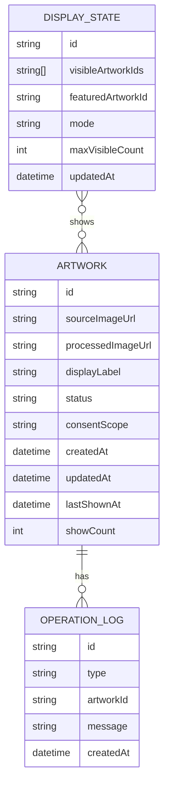

# ふわふわランド 基本設計 v0.1

> 最終更新: 2026-06-23

## 1. システム概要

### 1.1 MVP構成

初期MVPは、Vite/React/PixiJS の単一Webアプリとして構成する。バックエンドは必須にしない。2026-06-25 の技術検証では、ブラウザ内状態と `localStorage` / `IndexedDB` 相当で成立性を確認する。

```txt
スタッフ画面
  - 画像登録
  - 作品一覧
  - 指定表示
  - 非表示
  - リセット

表示画面
  - ふわふわランド
  - 登録作品の表示
  - ランダム入替
  - 主役表示

共有状態
  - MVP: 同一ブラウザ/同一PC内 localStorage
  - 次段階: Supabase / WebSocket / BroadcastChannel
```

### 1.2 画面分離

当日は以下のどちらかで運用する。

#### A案: 1台PC運用

```txt
表示PC
  - タブ1: /fuwafuwa/display をモニター表示
  - タブ2: /fuwafuwa/staff をスタッフ操作
```

利点:

- ネットワーク依存が小さい。
- 状態共有が簡単。
- 6/25検証が速い。

欠点:

- スタッフが表示PCを操作する必要がある。
- 撮影端末から直接送るには追加実装が必要。

#### B案: スタッフ端末 + 表示PC

```txt
スタッフ端末
  - /fuwafuwa/staff
  - 撮影/登録

表示PC
  - /fuwafuwa/display
  - モニター表示

共有
  - Supabase Realtime or 簡易WebSocket
```

利点:

- 現場導線が自然。
- 撮影台と表示台を分けられる。

欠点:

- ネットワーク依存が上がる。
- 2026-06-25 の最小検証としては重い。

2026-06-25 判定ではA案を優先し、8/2本番に向けてB案へ拡張するか判断する。

## 2. テーブル定義

MVPではDBを使わない。ただし、将来DB化しても破綻しないように、内部データ構造をテーブル定義に近い形で持つ。

### 2.1 artwork

| カラム | 型 | 必須 | 説明 |
|---|---|---:|---|
| id | string | Yes | 作品ID。例: `ART-0001` |
| sourceImageUrl | string | Yes | 元画像のObject URL/Data URL/Storage URL |
| processedImageUrl | string | No | 背景除去後の画像URL |
| title | string | No | 任意の作品名。初期は未使用 |
| displayLabel | string | Yes | 画面表示用番号 |
| status | enum | Yes | `queued` / `visible` / `hidden` / `archived` |
| createdAt | string | Yes | ISO日時 |
| updatedAt | string | Yes | ISO日時 |
| lastShownAt | string | No | 最終表示日時 |
| showCount | number | Yes | 表示回数 |
| consentScope | enum | Yes | `event_only` / `SNS_allowed` / `unknown` |
| notes | string | No | スタッフメモ |

### 2.2 display_state

| カラム | 型 | 必須 | 説明 |
|---|---|---:|---|
| id | string | Yes | 固定で `current` |
| visibleArtworkIds | string[] | Yes | 現在表示中の作品ID |
| featuredArtworkId | string | No | 主役表示中の作品ID |
| mode | enum | Yes | `idle` / `random` / `featured` / `paused` |
| maxVisibleCount | number | Yes | 同時表示数 |
| updatedAt | string | Yes | ISO日時 |

### 2.3 operation_log

| カラム | 型 | 必須 | 説明 |
|---|---|---:|---|
| id | string | Yes | ログID |
| type | enum | Yes | `register` / `show` / `hide` / `reset` / `error` |
| artworkId | string | No | 対象作品ID |
| message | string | Yes | 操作内容 |
| createdAt | string | Yes | ISO日時 |

## 3. ER図



## 4. 画面遷移

```txt
/fuwafuwa
  ↓
  ├─ /fuwafuwa/display
  │    ├─ idle
  │    ├─ random display
  │    └─ featured display
  │
  └─ /fuwafuwa/staff
       ├─ register artwork
       ├─ artwork list
       ├─ display controls
       └─ recovery controls
```

## 5. 画面一覧

| 画面ID | パス | 対象 | 説明 | 優先度 |
|---|---|---|---|---:|
| SC-001 | `/fuwafuwa/display` | 来場者 | モニターに表示する世界 | Must |
| SC-002 | `/fuwafuwa/staff` | スタッフ | 作品登録・表示制御 | Must |
| SC-003 | `/fuwafuwa` | スタッフ | 画面選択 | Should |
| SC-004 | `/fuwafuwa/debug` | 開発者 | FPS/メモリ/状態確認 | Could |

## 6. 画面UI定義書

### 6.1 表示画面

目的:

- 子どもが自分の作品を見つけられる。
- すーすーわーわーの世界に入った感覚がある。
- 過密にしない。

構成:

```txt
┌──────────────────────────────┐
│ ふわふわランド背景             │
│                              │
│  作品A     すーすー           │
│        作品B                 │
│                 わーわー      │
│      主役作品C                │
│                              │
│  作品D          作品E         │
│                              │
│ 下部: 小さな案内/イベント名    │
└──────────────────────────────┘
```

表示ルール:

- 同時表示標準: 8〜20体。
- 最大表示: 30体まで。6/25検証で性能を確認する。
- 主役表示中は、主役作品を通常の1.5〜2倍程度で中央寄りに表示。
- ランダム表示では、表示中の一部だけを入れ替える。
- 画面を埋め尽くさない。

### 6.2 スタッフ画面

目的:

- 1人でも迷わず登録できる。
- 操作ミス時にすぐ戻せる。
- 表示中の状態が分かる。

構成:

```txt
┌──────────────────────────────┐
│ 登録                         │
│ [カメラで撮る] [画像を選ぶ]    │
│ プレビュー                    │
│ [登録して表示] [登録のみ]      │
├──────────────────────────────┤
│ 表示操作                     │
│ [全リセット] [ランダム表示]    │
│ 最大表示数 [ - 12 + ]         │
├──────────────────────────────┤
│ 作品一覧                     │
│ ART-0001 [表示] [主役] [非表示]│
│ ART-0002 [表示] [主役] [非表示]│
└──────────────────────────────┘
```

必須UI:

- 画像プレビュー。
- 登録ボタン。
- 表示中作品数。
- 全リセットボタン。
- ランダム表示ボタン。
- 作品ごとの表示/主役/非表示ボタン。

### 6.3 2台モニター連結時

2台連結時も特別なUIを作らず、ブラウザの表示幅に応じてワールド幅を広げる。主役表示は中央1/2領域に寄せる。端に作品が寄りすぎて見えない状態を避ける。

